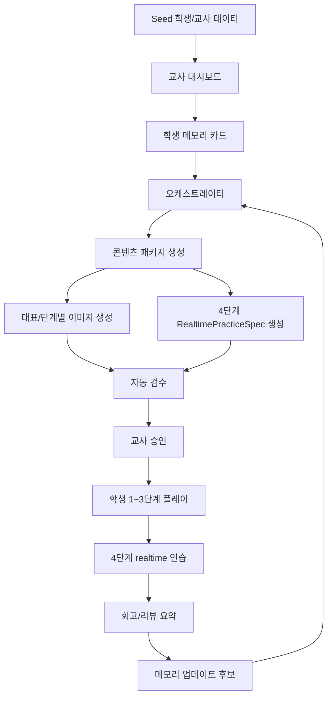

# Agent Navigation

이 문서는 레포를 처음 여는 에이전트가 길을 잃지 않도록 만든 문서 지도다.

## Reading Order

1. [../AGENTS.md](../AGENTS.md) - 작업 규칙
2. [../GOAL.md](../GOAL.md) - 장기 목표와 마일스톤
3. [13-implementation-backlog.md](13-implementation-backlog.md) - 지금 할 일
4. 현재 작업과 관련된 상세 문서

## Task Router

| 작업 주제 | 먼저 볼 문서 | 같이 볼 문서 |
| --- | --- | --- |
| 학생 콘텐츠 경험 | [01-child-content-experience.md](01-child-content-experience.md) | [04-ai-content-template-spec.md](04-ai-content-template-spec.md), [09-image-content-package-spec.md](09-image-content-package-spec.md) |
| 오케스트레이터/메모리 | [02-orchestrator-memory.md](02-orchestrator-memory.md) | [03-ai-backend-system-design.md](03-ai-backend-system-design.md), [05-backend-feature-spec.md](05-backend-feature-spec.md) |
| AI 백엔드 전체 구조 | [03-ai-backend-system-design.md](03-ai-backend-system-design.md) | [11-database-schema-spec.md](11-database-schema-spec.md), [12-rest-api-spec.md](12-rest-api-spec.md) |
| 템플릿/콘텐츠 JSON | [04-ai-content-template-spec.md](04-ai-content-template-spec.md) | [09-image-content-package-spec.md](09-image-content-package-spec.md) |
| 4단계 realtime | [07-realtime-practice-spec.md](07-realtime-practice-spec.md) | [12-rest-api-spec.md](12-rest-api-spec.md) |
| 공공데이터 | [06-public-data-strategy.md](06-public-data-strategy.md) | [10-data-api-requirements.md](10-data-api-requirements.md) |
| seed/auth/아이등록 | [08-demo-seed-auth-registration-plan.md](08-demo-seed-auth-registration-plan.md) | [11-database-schema-spec.md](11-database-schema-spec.md), [12-rest-api-spec.md](12-rest-api-spec.md) |
| DB 모델 구현 | [11-database-schema-spec.md](11-database-schema-spec.md) | [05-backend-feature-spec.md](05-backend-feature-spec.md) |
| REST API 구현 | [12-rest-api-spec.md](12-rest-api-spec.md) | [11-database-schema-spec.md](11-database-schema-spec.md) |

## Canonical Vocabulary

| 용어 | 의미 |
| --- | --- |
| `life_support` | 일상생활 도움이 더 필요한 학생 유형 |
| `learning_focus` | 실제 학습 보완이 주된 학생 유형 |
| `MissionContent` | 한 회기 학생 미션 콘텐츠 패키지 |
| `ContentStage` | 학생이 진행하는 1~4단계 |
| `RealtimePracticeSpec` | 4단계 실시간 연습의 승인된 역할/질문/루브릭 스펙 |
| `MemoryCard` | 학생별 장기 맥락 카드 |
| `AgentRun` | AI 실행 입력/출력/상태 로그 |
| `ReviewSummary` | 플레이 종료 후 다음 회기에 넘기는 요약 |

## Flow Map



## Link Integrity Rules

- 문서 링크는 가능하면 상대 경로로 둔다.
- README에는 핵심 문서 전체가 노출되어야 한다.
- 새 문서를 만들면 README와 이 파일에 모두 링크를 추가한다.
- 파일명 변경 시 `rg -n "old-file-name"`으로 역참조를 찾는다.

## Quick Checks

```bash
git status --short --branch
rg -n "5[단]계|마지막[ ]실시간|마지막[ ]realtime|R[e]motion|f[f]mpeg" README.md AGENTS.md GOAL.md docs .agents
git diff --check
```
