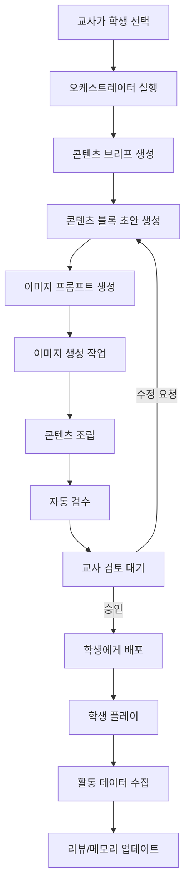

# 아이 맞춤 콘텐츠 경험 설계

## 1. 핵심 정의

이 서비스에서 AI가 만드는 것은 단순 이미지가 아니라 **한 회기용 학습 미션**이다.

이미지는 미션을 구성하는 하나의 블록일 뿐이고, 실제 콘텐츠는 다음 흐름을 가진다.

```text
왜 배우는지 연결
→ 그림 기반 개념 앵커
→ 짧은 설명
→ 쉬운 상호작용
→ 즉시 피드백
→ 틀린 포인트 교정
→ 4단계 실시간 연습
→ 짧은 회고
→ 다음 미션 예고
```

즉, 콘텐츠의 단위는 `image`가 아니라 `mission_content`이다.

## 2. 콘텐츠 설계 원칙

### 2.1 아이 화면은 관리 도구가 아니다

학생 화면은 학습관리시스템처럼 보이면 안 된다. 아이에게는 오늘 할 일이 짧고 분명한 미션처럼 보여야 한다.

좋은 방향:

- 오늘의 미션 1개만 먼저 보여준다.
- 한 화면에 설명을 많이 넣지 않는다.
- 이미지와 짧은 문장을 함께 쓴다.
- 선택지는 2~3개 정도로 제한한다.
- 오답을 틀림으로 끝내지 않고 바로 다시 이해할 수 있게 만든다.
- 마지막에는 상황 이미지 위에서 AI와 직접 말해보거나 입력하며 연습하게 한다.
- 실시간 연습이 끝나면 아이가 자기 상태를 짧게 표현하게 한다.

피해야 할 방향:

- 긴 이론 설명
- 문제집 페이지처럼 많은 문항 나열
- 이미지 안에 긴 한국어 문장 삽입
- 정답/오답만 기록하고 피드백이 없는 구조
- 학생에게 AI 판단 근거나 관리용 데이터를 직접 노출

### 2.2 이미지는 개념 앵커다

AI 이미지는 예쁜 삽화가 아니라 아이가 개념을 붙잡는 앵커 역할을 한다.

예시:

```text
개념: 분수
이미지: 같은 크기로 4조각 난 피자, 그중 1조각만 강조
UI 텍스트: 4조각 중 1조각은 몇 분의 몇일까요?
선택지: 1/4, 4/1, 1/2
```

이미지 안에는 가능한 한 텍스트를 넣지 않는다. 이미지 생성 모델은 그림을 만들고, 설명 문장과 선택지는 앱 UI의 텍스트 레이어가 담당한다.

### 2.3 성공 경험을 먼저 설계한다

자신감이 낮거나 회피가 있는 학생에게는 첫 문제부터 진단용 어려운 문항을 주면 안 된다.

오케스트레이터는 학생 상태에 따라 아래 중 하나를 선택한다.

- `success_first`: 매우 쉬운 성공 문항으로 시작
- `concept_first`: 개념 설명 카드로 시작
- `review_first`: 이전 오답을 짧게 복습하고 시작
- `challenge_first`: 이미 안정적인 학생에게 약간 도전적인 문항 제공

## 3. 한 회기 콘텐츠 기본 구조

MVP 기준 학생에게 보이는 핵심 콘텐츠는 4단계로 구성한다. 회고와 다음 미션 예고는 플레이 종료 후 이벤트/요약으로 붙으며, 별도 스테이지로 카운트하지 않는다.

```text
1. stage_1_intro
2. stage_2_basic_interaction
3. stage_3_applied_interaction
4. stage_4_realtime_practice
after. post_practice_reflection
after. next_action
```

### 3.1 블록 타입

| 블록 타입 | 목적 | 학생에게 보이는 형태 |
| --- | --- | --- |
| `mission_intro` | 오늘 목표를 짧게 제시 | "오늘은 피자로 분수를 알아볼 거예요." |
| `image_anchor` | 개념을 이미지로 붙잡게 함 | 그림 카드 |
| `micro_explanation` | 핵심 개념을 짧게 설명 | 1~3문장 카드 |
| `choice_question` | 이해 확인 | 2~3개 선택지 |
| `scenario_question` | 생활 상황 적용 | 짧은 상황 + 선택 |
| `adaptive_feedback` | 정답/오답별 반응 | 맞춤 피드백 카드 |
| `repair_card` | 틀린 포인트 교정 | 다시 보는 설명 카드 |
| `success_card` | 성공 경험 강화 | 칭찬 + 다음 작은 도전 |
| `realtime_practice` | 실제 말하기/설명 연습 | 상황 이미지 + AI 대화 |
| `post_practice_reflection` | 자기평가 수집 | 버튼 또는 한 줄 입력 |
| `next_action` | 다음 회기 연결 | 다음 미션 예고 |

## 4. 콘텐츠 생성 플로우



## 5. 콘텐츠 브리프

콘텐츠 에이전트는 바로 콘텐츠를 만들지 않는다. 먼저 오케스트레이터가 콘텐츠 브리프를 만든다.

브리프는 "이번 콘텐츠를 왜, 누구에게, 어떤 제약으로 만들 것인가"를 담는다.

```json
{
  "studentId": "stu_001",
  "sessionGoal": "분수에서 전체와 부분의 관계를 이해한다",
  "subject": "math",
  "unit": "fractions",
  "achievementStandard": "전체와 부분의 관계를 분수로 표현할 수 있다",
  "diagnosis": {
    "blockingTypes": ["concept_misunderstanding", "low_confidence"],
    "difficulty": "easy"
  },
  "studentProfileForContent": {
    "effectiveStyles": ["visual_example", "daily_life_context", "short_steps"],
    "avoidStyles": ["long_text", "abstract_definition_first"],
    "readingLoad": "low",
    "choiceCountLimit": 3
  },
  "strategy": {
    "startMode": "success_first",
    "primaryRepresentation": "image_card",
    "feedbackTone": "encouraging",
    "needsTeacherApproval": true
  }
}
```

## 6. 콘텐츠 데이터 모델

### 6.1 Mission Content

```json
{
  "id": "content_001",
  "studentId": "stu_001",
  "sessionId": "session_001",
  "status": "teacher_review",
  "title": "피자로 배우는 분수",
  "subject": "math",
  "unit": "fractions",
  "difficulty": "easy",
  "createdBy": "content_agent",
  "approvalRequired": true,
  "blocks": [
    {
      "id": "block_001",
      "type": "mission_intro",
      "order": 1,
      "studentText": "오늘은 피자를 나눠보면서 분수를 배워볼 거예요."
    },
    {
      "id": "block_002",
      "type": "image_anchor",
      "order": 2,
      "imageAssetId": "img_001",
      "studentText": "피자 한 판이 똑같이 4조각으로 나뉘어 있어요."
    },
    {
      "id": "block_003",
      "type": "choice_question",
      "order": 3,
      "question": "4조각 중 1조각은 몇 분의 몇일까요?",
      "choices": [
        { "id": "a", "text": "1/4" },
        { "id": "b", "text": "4/1" },
        { "id": "c", "text": "1/2" }
      ],
      "answer": "a"
    },
    {
      "id": "block_004",
      "type": "adaptive_feedback",
      "order": 4,
      "feedback": {
        "correct": "좋아요. 전체 4조각 중 1조각이니까 1/4이에요.",
        "wrong": "괜찮아요. 아래 숫자는 전체 조각 수, 위 숫자는 내가 가진 조각 수예요."
      }
    },
    {
      "id": "block_005",
      "type": "realtime_practice",
      "order": 4,
      "templateType": "realtime_teach_back",
      "practiceTitle": "별이에게 분수 설명하기",
      "openingLine": "왜 4/1이 아니라 1/4인지 알려줄래?",
      "rubric": ["mention_whole", "mention_part", "connect_fraction"]
    },
    {
      "id": "block_006",
      "type": "post_practice_reflection",
      "order": 6,
      "question": "AI와 연습해보니 어땠나요?",
      "choices": ["말할 수 있었어요", "조금 헷갈렸어요", "다시 연습하고 싶어요"]
    }
  ]
}
```

### 6.2 Image Asset

```json
{
  "id": "img_001",
  "contentId": "content_001",
  "purpose": "concept_anchor",
  "prompt": "A simple child-friendly illustration of one whole pizza divided into four equal slices, one slice highlighted. No text in the image.",
  "negativePrompt": "text, letters, labels, watermark, complex background",
  "model": "image_generation_adapter",
  "status": "generated",
  "storageUrl": "s3://...",
  "safetyChecked": true
}
```

## 7. 콘텐츠 상태 머신

AI가 콘텐츠를 만들었다고 학생에게 바로 배포되면 안 된다.

```text
draft
→ generating_assets
→ ai_checked
→ teacher_review
→ revision_requested
→ approved
→ published
→ in_progress
→ completed
→ reviewed
→ archived
```

핵심 규칙:

- `published` 전에는 반드시 교사 승인이 필요하다.
- AI 생성물은 기본적으로 `teacher_review` 상태에 머문다.
- 교사는 블록별로 텍스트 수정, 삭제, 재생성을 요청할 수 있다.
- 승인된 버전과 생성 초안은 분리해서 보관한다.
- 학생이 수행한 뒤에는 해당 콘텐츠 버전을 변경하지 않는다.

## 8. 자동 검수 항목

교사 검토 전에 시스템이 1차 검수를 수행한다.

| 검수 항목 | 설명 |
| --- | --- |
| 정답 검증 | 문제, 선택지, 정답, 피드백이 서로 일치하는지 확인 |
| 난이도 검증 | 학생 메모리와 브리프 난이도에 맞는지 확인 |
| 문장 길이 검증 | 한 문장이 너무 길지 않은지 확인 |
| 이미지 검수 | 텍스트 과다, 부적절 이미지, 개념 불일치 확인 |
| 개인정보 검수 | 학생 실명, 민감 정보가 콘텐츠에 직접 노출되지 않는지 확인 |
| 교육과정 연결 | 성취기준 또는 단원 태그가 연결되어 있는지 확인 |

## 9. 학생 활동 이벤트

학생이 콘텐츠를 수행하면 아래 이벤트를 수집한다.

```text
content_started
block_viewed
image_viewed
choice_selected
answer_submitted
feedback_viewed
hint_used
block_replayed
realtime_session_started
realtime_feedback_received
realtime_session_completed
content_completed
post_practice_reflection_submitted
content_abandoned
```

이벤트는 다음 회기 생성의 근거 데이터가 된다.

```json
{
  "eventType": "answer_submitted",
  "contentId": "content_001",
  "blockId": "block_003",
  "studentId": "stu_001",
  "selectedChoiceId": "b",
  "isCorrect": false,
  "durationMs": 18400,
  "createdAt": "2026-04-28T10:00:00Z"
}
```

## 10. MVP 콘텐츠 구성

MVP에서는 아래 블록만 먼저 구현해도 충분하다.

```text
mission_intro
image_anchor
micro_explanation
choice_question
adaptive_feedback
realtime_practice
post_practice_reflection
next_action
```

드래그앤드롭은 2차 이후로 미룬다. 영상 생성은 현재 범위에서 제외한다. 4단계 실시간 연습은 MVP 차별점으로 별도 구현한다.

MVP의 강점은 영상 생성이 아니라, **학생별 맥락에 맞춘 이미지 카드형 미션을 AI가 만들고 교사가 승인한 뒤, 4단계에서 짧은 실시간 연습까지 이어진다는 구조**다.

## 11. 교사 검토 화면에서 보여줄 정보

교사는 콘텐츠만 보는 것이 아니라, AI가 왜 이 콘텐츠를 만들었는지 함께 봐야 한다.

```text
오늘 회기 목표
AI 판단 요약
학생 최근 반응
선택된 콘텐츠 전략
생성된 이미지
학생용 문장
퀴즈/정답/피드백
주의할 표현
승인/수정/재생성 버튼
```

예시:

```json
{
  "teacherReviewSummary": {
    "reason": "최근 3회기에서 분모와 분자 혼동이 반복되었고, 그림 기반 설명에는 집중도가 높았습니다.",
    "strategy": "쉬운 성공 경험 후 피자 그림으로 전체와 부분을 연결합니다.",
    "caution": "긴 정의 설명보다 그림을 먼저 보여주는 것이 좋습니다."
  }
}
```

## 12. 결론

아이에게 필요한 콘텐츠는 이미지 파일 하나가 아니라, 다음 요소가 결합된 짧은 회기형 경험이다.

```text
개념 이미지
+ 짧은 설명
+ 상호작용
+ 즉시 피드백
+ 교정 카드
+ 자기평가
+ 다음 미션
```

이 구조를 잡아야 AI 이미지 생성의 장점이 실제 학습 개입으로 이어진다.
