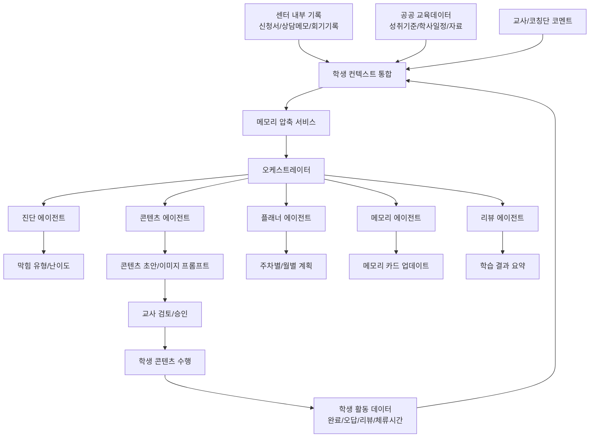
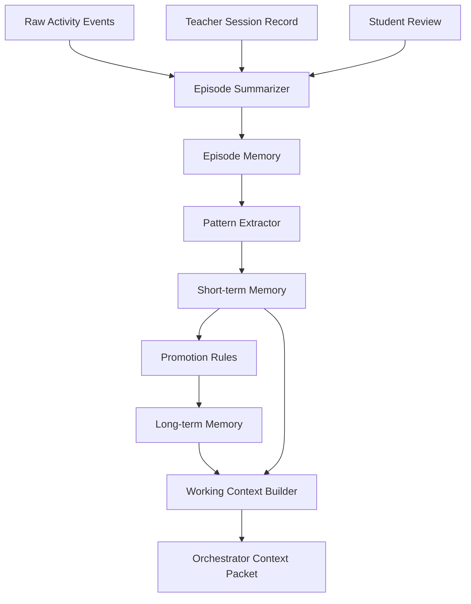

# 오케스트레이터 및 메모리 압축 설계

## 1. 핵심 개념

이 백엔드의 중심은 오케스트레이터다.

오케스트레이터의 역할은 "콘텐츠를 바로 생성하는 것"이 아니라, **지금 이 학생에게 다음 회기에 무엇을 해야 하는지 판단하는 것**이다.

```text
학생 기록 수집
→ 학생 컨텍스트 압축
→ 오케스트레이터 판단
→ 에이전트 실행
→ 교사 승인
→ 학생 수행
→ 결과 리뷰
→ 메모리 업데이트
→ 다음 판단에 반영
```

## 2. 전체 구조



## 3. 오케스트레이터 입력

오케스트레이터는 원본 로그 전체를 직접 읽지 않는다. 메모리 압축 서비스가 만든 실행용 컨텍스트 패킷을 입력으로 받는다.

### 3.1 Orchestrator Context Packet

```json
{
  "studentSnapshot": {
    "studentId": "stu_001",
    "grade": "middle_2",
    "primaryIssue": "concept_misunderstanding",
    "emotionalRisk": "low_confidence",
    "guardianCooperation": "normal"
  },
  "currentLearningTarget": {
    "subject": "math",
    "unit": "fractions",
    "achievementStandard": "전체와 부분의 관계를 분수로 표현할 수 있다",
    "schoolSchedule": "다음 주 단원평가 예정"
  },
  "recentMemory": {
    "lastSessions": [
      {
        "sessionId": "session_001",
        "summary": "피자 그림에는 집중했으나 4/1을 선택함",
        "observedBlockingType": "numerator_denominator_confusion"
      },
      {
        "sessionId": "session_002",
        "summary": "긴 문장 설명 후 회피가 증가함",
        "observedBlockingType": "text_load_avoidance"
      }
    ],
    "recentPattern": "시각 자료 반응은 좋으나 분모/분자 역할 혼동이 반복됨"
  },
  "longTermMemory": {
    "effectiveStyles": ["visual_example", "daily_life_context", "short_steps"],
    "avoidStyles": ["long_text", "abstract_definition_first"],
    "stableWeakUnits": ["fractions", "word_problems"],
    "teacherVerifiedNotes": [
      "첫 문항은 쉬운 성공 경험으로 시작하는 것이 좋음"
    ]
  },
  "latestActivity": {
    "contentId": "content_001",
    "completionStatus": "completed",
    "accuracy": 0.5,
    "wrongPatterns": ["selected_inverse_fraction"],
    "reflection": "조금 헷갈렸어요",
    "averageBlockDurationMs": 21000
  }
}
```

## 4. 오케스트레이터 출력

오케스트레이터는 에이전트에게 일을 배분하기 위한 실행 계획을 만든다.

```json
{
  "orchestratorRunId": "orch_001",
  "studentId": "stu_001",
  "sessionGoal": "분수에서 전체와 부분의 관계를 시각적으로 재확인한다",
  "diagnosisRequest": {
    "required": true,
    "focus": ["concept_misunderstanding", "confidence"]
  },
  "contentRequest": {
    "required": true,
    "contentType": "image_card_mission",
    "difficulty": "easy",
    "startMode": "success_first",
    "blockPlan": [
      "mission_intro",
      "image_anchor",
      "micro_explanation",
      "choice_question",
      "adaptive_feedback",
      "reflection"
    ]
  },
  "teacherGuidance": {
    "summary": "그림을 먼저 보여주고 전체 조각 수를 손으로 세게 하는 방식이 좋습니다.",
    "caution": "분수 정의를 문장으로 길게 설명하지 마세요."
  },
  "reasoningSummary": "최근 2회기에서 분모와 분자 혼동이 반복되었고 시각 자료에는 집중도가 높았습니다. 자신감 저하가 있어 쉬운 성공 문항으로 시작합니다.",
  "nextActions": [
    {
      "type": "generate_content",
      "targetAgent": "content_agent",
      "priority": "high"
    },
    {
      "type": "update_week_plan",
      "targetAgent": "planner_agent",
      "priority": "normal"
    }
  ]
}
```

## 5. 에이전트 역할

| 에이전트 | 역할 | 입력 | 출력 |
| --- | --- | --- | --- |
| 메모리 에이전트 | 학생 장기 맥락 업데이트 | 회기 기록, 활동 결과, 리뷰 | 메모리 카드 변경안 |
| 진단 에이전트 | 막힘 원인 분류 | 오답, 체류시간, 교사 메모 | 막힘 유형, 난이도 |
| 콘텐츠 에이전트 | 회기형 콘텐츠 생성 | 콘텐츠 브리프, 성취기준, 학생 특성 | 블록 초안, 이미지 프롬프트 |
| 리뷰 에이전트 | 수행 결과 해석 | 정답률, 이벤트, 자기평가 | 이해도, 감정 톤, 다음 제안 |
| 플래너 에이전트 | 계획 업데이트 | 누적 메모리, 진단 결과 | 주간/월간 계획 변경안 |

## 6. 메모리 설계 원칙

메모리는 원본 기록을 대체하지 않는다. 원본 기록은 그대로 보관하고, AI 실행에 필요한 맥락만 압축한다.

```text
Raw Log는 증거
Episode Memory는 회기 요약
Short-term Memory는 최근 흐름
Long-term Memory는 안정 패턴
Working Context는 오케스트레이터 실행용 압축본
```

## 7. 메모리 레이어

| 레이어 | 설명 | 보존/갱신 |
| --- | --- | --- |
| Raw Log | 원본 이벤트, 교사 기록, 상담 메모, 리뷰 원문 | 정책 기준 장기 보관 |
| Episode Memory | 회기 단위 요약 | 콘텐츠 완료/회기 기록 저장 후 생성 |
| Short-term Memory | 최근 3~5회기 또는 최근 4주 흐름 | 매 회기 또는 주간 갱신 |
| Long-term Memory | 반복 패턴, 잘 맞는 설명 방식, 정서 특성 | 주간/월간 승격 |
| Working Context | 오케스트레이터 실행에 필요한 최소 패킷 | 실행 시점에 생성 |

## 8. 메모리 압축 플로우



## 9. Episode Memory

회기 하나를 짧고 검증 가능한 형태로 요약한다.

```json
{
  "id": "episode_memory_001",
  "studentId": "stu_001",
  "sessionId": "session_001",
  "contentId": "content_001",
  "summary": "피자 4조각 이미지에는 집중했으나 4/1을 선택해 분모/분자 역할을 혼동함.",
  "observations": [
    {
      "type": "wrong_pattern",
      "value": "selected_inverse_fraction",
      "evidenceEventIds": ["event_101"]
    },
    {
      "type": "positive_response",
      "value": "visual_anchor_engaged",
      "evidenceEventIds": ["event_090", "event_091"]
    }
  ],
  "studentEmotion": "confused_but_engaged",
  "teacherNoteSummary": "긴 설명보다 그림 중심 접근이 효과적임.",
  "createdAt": "2026-04-28T10:00:00Z"
}
```

## 10. Short-term Memory

최근 흐름을 담는다. 보통 최근 3~5회기 또는 4주 기준으로 갱신한다.

```json
{
  "studentId": "stu_001",
  "window": {
    "type": "last_sessions",
    "size": 5
  },
  "summary": "최근 분수 학습에서 분모/분자 역할 혼동이 반복됨. 시각 자료에는 집중하지만 긴 문장 설명 후 회피가 증가함.",
  "activePatterns": [
    {
      "pattern": "numerator_denominator_confusion",
      "count": 3,
      "confidence": 0.84,
      "lastObservedAt": "2026-04-28"
    },
    {
      "pattern": "visual_example_positive_response",
      "count": 4,
      "confidence": 0.88,
      "lastObservedAt": "2026-04-28"
    }
  ],
  "recommendedConstraints": [
    "choice_count_max_3",
    "image_first",
    "short_sentence"
  ]
}
```

## 11. Long-term Memory

장기 메모리는 안정적으로 반복된 특성을 저장한다.

```json
{
  "studentId": "stu_001",
  "learningProfile": {
    "effectiveExplanationStyles": ["visual_example", "daily_life_context", "step_by_step"],
    "avoidExplanationStyles": ["long_text", "abstract_definition_first"],
    "frequentBlockingTypes": ["concept_misunderstanding", "word_problem_interpretation"],
    "stableWeakUnits": ["fractions"]
  },
  "emotionalProfile": {
    "riskFactors": ["low_confidence_after_wrong_answer"],
    "supportStrategies": ["success_first", "encouraging_feedback"]
  },
  "guardianContext": {
    "cooperationLevel": "normal",
    "notes": "가정 복습은 주 1회 가능"
  },
  "humanVerified": true,
  "lastUpdatedAt": "2026-04-28T10:00:00Z"
}
```

## 12. 메모리 주장 구조

메모리는 단순 텍스트 요약만 있으면 안 된다. 주장, 근거, 신뢰도, 사용법을 함께 저장한다.

```json
{
  "id": "memory_claim_001",
  "studentId": "stu_001",
  "category": "learning_pattern",
  "claim": "분모와 분자의 역할을 자주 혼동한다",
  "evidence": [
    {
      "sourceType": "activity_event",
      "sourceId": "event_101",
      "summary": "1/4 문항에서 4/1 선택"
    },
    {
      "sourceType": "teacher_record",
      "sourceId": "record_022",
      "summary": "전체 수와 가진 수 구분 어려움"
    }
  ],
  "confidence": 0.82,
  "status": "active",
  "recommendedUse": "분모=전체, 분자=가진 것이라는 시각 설명 우선",
  "lastObservedAt": "2026-04-28",
  "humanVerified": false
}
```

## 13. 압축 타이밍

| 시점 | 실행 작업 | 결과 |
| --- | --- | --- |
| 콘텐츠 완료 직후 | 리뷰 에이전트 실행 | 활동 결과 요약 |
| 교사 회기 기록 저장 직후 | Episode Memory 생성 | 회기 요약 |
| 하루 1회 | 최근 메모리 재계산 | Short-term Memory 갱신 |
| 주간 마감 | 반복 패턴 추출 | 주간 요약, 계획 업데이트 |
| 월간 마감 | 장기 패턴 승격 | Long-term Memory 갱신 |

## 14. 패턴 승격 규칙

초기 규칙은 명확하고 설명 가능해야 한다.

```text
최근 3회 중 2회 이상 같은 오답 패턴 발생
→ Short-term Memory active pattern 등록

4주 이상 반복되거나 교사 메모와 일치
→ Long-term Memory 승격

최근 3회에서 더 이상 나타나지 않음
→ confidence 감소

교사가 직접 확인 또는 수정
→ humanVerified = true

교사가 반박
→ status = dismissed 또는 confidence 하향
```

## 15. 신뢰도 계산 기준

MVP에서는 복잡한 모델보다 규칙 기반 점수로 시작한다.

```text
base score = 0.4
+ 같은 패턴 반복 횟수
+ 교사 기록과 일치
+ 학생 활동 데이터와 일치
+ 최근성
- 반대 증거 존재
- 오래 관찰되지 않음
```

예시:

```json
{
  "pattern": "visual_example_positive_response",
  "signals": {
    "repeatedCount": 4,
    "teacherMentioned": true,
    "recentlyObserved": true,
    "contradictionCount": 0
  },
  "confidence": 0.88
}
```

## 16. 오케스트레이터 실행 단계

```text
1. 학생 선택 또는 회기 시작 요청
2. Working Context 생성
3. 진단 필요 여부 판단
4. 이번 회기 목표 결정
5. 콘텐츠 전략 결정
6. 콘텐츠 브리프 생성
7. 필요한 에이전트 작업 큐 등록
8. 교사용 판단 요약 생성
9. 콘텐츠 초안 생성 후 검수
10. 교사 검토 상태로 전환
```

## 17. 오케스트레이터 판단 기준

| 판단 항목 | 가능한 값 |
| --- | --- |
| 이번 회기 목표 | 개념 재설명, 복습, 적용, 자신감 회복, 평가 대비 |
| 시작 방식 | 성공 경험 먼저, 개념 설명 먼저, 이전 오답 복습, 도전 문항 |
| 콘텐츠 형식 | 이미지 카드, 선택형 퀴즈, 시나리오, 교정 카드, 4단계 실시간 연습, 회고 |
| 난이도 | very_easy, easy, normal, challenge |
| 설명 방식 | 시각 자료, 생활 예시, 단계별 풀이, 짧은 문장 |
| 교사 개입 | 설명 필요, 관찰 필요, 보호자 안내 필요 |

## 18. Agent Run 저장

모든 AI 실행은 저장되어야 한다. 그래야 디버깅, 교사 검토, 발표 자료로 사용할 수 있다.

```json
{
  "agentRunId": "agent_run_001",
  "orchestratorRunId": "orch_001",
  "studentId": "stu_001",
  "agentType": "content_agent",
  "inputSnapshot": {},
  "outputJson": {},
  "modelName": "content_generation_model",
  "status": "succeeded",
  "errorMessage": null,
  "createdAt": "2026-04-28T10:00:00Z"
}
```

## 19. 데이터베이스 초안

```text
students
student_profiles
student_memory_cards
memory_claims
memory_evidence_links
episode_memories
short_term_memories
long_term_memories

session_records
weekly_reports
monthly_reports

content_units
content_blocks
image_assets
content_assignments
content_attempts
activity_events
student_reviews

orchestrator_runs
agent_runs
diagnosis_results
planner_recommendations

public_learning_standards
school_calendars
school_timetables

teacher_approvals
audit_logs
consent_records
```

## 20. API 초안

### 오케스트레이터

```text
POST /students/:studentId/orchestrator-runs
GET  /orchestrator-runs/:runId
POST /orchestrator-runs/:runId/execute
```

### 메모리

```text
GET  /students/:studentId/memory-card
GET  /students/:studentId/memory-claims
POST /students/:studentId/memory-compressions
PATCH /memory-claims/:claimId
POST /memory-claims/:claimId/verify
POST /memory-claims/:claimId/dismiss
```

### 콘텐츠

```text
POST /students/:studentId/contents/generate
GET  /contents/:contentId
PATCH /contents/:contentId/blocks/:blockId
POST /contents/:contentId/request-revision
POST /contents/:contentId/approve
POST /contents/:contentId/publish
```

### 학생 활동

```text
GET  /me/today-content
POST /contents/:contentId/start
POST /contents/:contentId/events
POST /contents/:contentId/answers
POST /contents/:contentId/review
POST /contents/:contentId/complete
```

## 21. MVP 구현 범위

1차 MVP에서는 아래만 구현한다.

```text
학생 상세 메모리 카드
교사 회기 기록
오케스트레이터 실행
콘텐츠 브리프 생성
이미지 카드형 콘텐츠 생성
교사 승인
학생 수행 이벤트 저장
리뷰 에이전트 요약
Episode Memory 생성
Short-term Memory 업데이트
다음 회기 추천 생성
```

Long-term Memory, 공공데이터 자동 동기화, 보호자 카드, 월간 리포트는 2차로 미룬다.

## 22. 결론

오케스트레이터와 메모리 압축의 핵심은 다음 한 문장으로 정리된다.

```text
원본 기록은 증거로 남기고, AI는 압축된 학생 맥락을 읽어 다음 회기 목표와 콘텐츠 전략을 결정한다.
```

이 구조가 있어야 학생별 맞춤 콘텐츠가 단발 생성이 아니라, 회기마다 더 정교해지는 개입 시스템이 된다.
