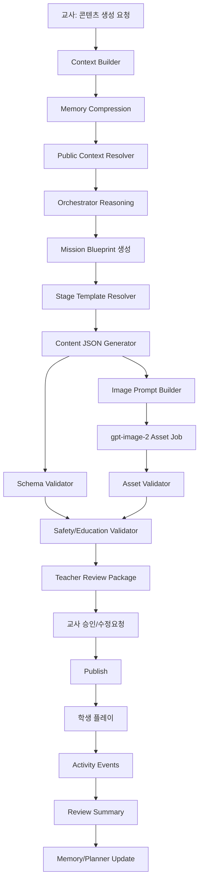

# 백엔드 기능 명세 및 AI 워크플로우

## 1. 목표

이 백엔드는 교사/센터가 학생을 사례 단위로 관리하고, AI가 학생 맥락을 바탕으로 5단계 맞춤 콘텐츠 패키지를 생성하며, 교사가 승인한 콘텐츠만 학생에게 배포하는 시스템이다.

핵심 흐름은 아래와 같다.

```text
학생/사례 등록
→ 센터 기록·교사 메모·활동 데이터 수집
→ 메모리 압축
→ 오케스트레이터가 콘텐츠 계획 결정
→ AI가 전체 콘텐츠 패키지 생성
→ 자동 검수
→ 교사 검토/승인
→ 학생 플레이
→ 활동 이벤트 저장
→ 리뷰 요약 및 메모리 업데이트
```

절대 원칙:

```text
학생 플레이 중 새 AI 분석/생성/후처리를 하지 않는다.
학생 화면은 승인된 JSON과 승인된 에셋만 실행한다.
AI 생성물은 반드시 스키마 검증과 교사 승인을 거친다.
공공데이터는 학생 개인 진단값이 아니라 맥락/근거/교육과정 연결 정보로 사용한다.
```

## 2. 사용자 역할

| 역할 | 설명 | 주요 권한 |
| --- | --- | --- |
| `center_admin` | 센터 관리자 | 조직/사용자/학생 전체 관리, 데이터 동기화, 감사 로그 조회 |
| `teacher` | 교사/코칭단 | 학생 사례 조회, 메모 작성, 콘텐츠 생성 요청, 승인/반려 |
| `content_reviewer` | 콘텐츠 검수자 | AI 생성 콘텐츠 품질 검수, 수정 요청 |
| `student` | 학생 | 승인/배포된 콘텐츠 플레이, 회고 제출 |
| `guardian` | 보호자 | 선택 기능. 학부모용 요약 카드 조회 |

권한 원칙:

```text
학생 개인정보는 같은 조직 안에서만 접근한다.
AI 프롬프트와 로그에는 불필요한 실명/연락처/주소를 넣지 않는다.
학생 계정은 콘텐츠 조회와 이벤트 제출만 가능하다.
교사 승인 전 콘텐츠는 학생 API에서 절대 반환하지 않는다.
```

## 3. 도메인 경계

초기 백엔드는 아래 모듈로 나눈다.

| 모듈 | 책임 |
| --- | --- |
| `AuthModule` | 로그인, 세션, 역할 권한 |
| `OrganizationModule` | 센터/학교/운영 조직 관리 |
| `StudentModule` | 학생 프로필, 학년, 학교, 관심사, 지원 유형 |
| `CaseModule` | 상담 신청서, 사례 목표, 회기 기록, 코칭 메모 |
| `MemoryModule` | 학생별 장기 메모리 카드, 메모리 스냅샷, 압축 이력 |
| `PlannerModule` | 주차별/월별 목표와 다음 회기 추천 |
| `PublicEducationDataModule` | NEIS, 교육과정, 교육통계 등 공공데이터 수집/정규화 |
| `OrchestratorModule` | 학생 맥락을 읽고 오늘 콘텐츠 방향 결정 |
| `ContentModule` | 미션 콘텐츠, 스테이지, 템플릿 JSON 관리 |
| `AssetModule` | 이미지, 음성, 영상 에셋 생성/저장/검수 |
| `ApprovalModule` | 교사 검토, 승인, 반려, 수정 요청 |
| `ActivityModule` | 학생 플레이 이벤트 수집 |
| `ReviewModule` | 수행 결과 요약, 다음 회기 근거 생성 |
| `AgentRunModule` | AI 실행 로그, 입력/출력, 실패/재시도 관리 |
| `AuditModule` | 개인정보 접근/수정/승인 로그 |
| `ConsentModule` | 개인정보 활용 동의, 보호자 동의, 데이터 보존 정책 |

## 4. 기술 스택

MVP 권장 스택:

```text
Runtime: Node.js + TypeScript
API Framework: NestJS 또는 Fastify
ORM: Prisma
DB: PostgreSQL
Queue: Redis + BullMQ
Object Storage: S3 호환 스토리지
AI: OpenAI reasoning/content JSON + gpt-image-2 이미지 생성
Voice(Optional): ElevenLabs
Video(Optional): Remotion + ffmpeg
Validation: Zod 또는 JSON Schema
Observability: structured log + job trace id
```

프론트가 Next.js/TypeScript 기반이므로 `packages/shared`에 콘텐츠 스키마와 타입을 두고 프론트/백엔드가 같이 쓰는 구조가 좋다.

권장 구조:

```text
apps/api
packages/shared
packages/ai
packages/content-runtime
packages/public-data
```

## 5. 콘텐츠 생성 전체 워크플로우



## 6. AI 워크플로우 상세

### 6.1 Context Builder

역할:

```text
AI 입력에 필요한 학생 맥락만 안전하게 모은다.
```

입력:

```text
student_profile
support_case
latest_session_records
teacher_comments
memory_card
recent_activity_summary
public_context_bundle
```

출력:

```json
{
  "studentContext": {
    "gradeBand": "middle_2",
    "studentType": "learning_focus",
    "primaryNeed": "fraction_concept",
    "effectiveStyles": ["visual_step", "short_sentence", "success_first"],
    "avoidStyles": ["long_text", "abstract_only"],
    "recentBlockingTypes": ["concept_misunderstanding", "procedure_skip"]
  },
  "generationGoal": {
    "targetSubject": "math",
    "unit": "fraction",
    "achievementStandardId": "NCIC-MATH-MID-FRACTION-001",
    "sessionObjective": "전체 중 일부를 분수로 표현한다"
  }
}
```

개인정보 처리:

```text
이름은 displayName 또는 별칭으로 치환한다.
학교명은 일정/시간표 조회 키로만 사용하고 AI 프롬프트에는 필요할 때만 넣는다.
주소/연락처/상담 민감문구는 프롬프트에 원문 그대로 넣지 않는다.
```

### 6.2 Memory Compression

역할:

```text
원본 회기 기록을 다음 콘텐츠 생성에 필요한 장기 맥락으로 압축한다.
```

압축 트리거:

```text
회기 기록 저장 후
학생 콘텐츠 완료 후 리뷰 요약 생성 시
교사가 메모리 카드 직접 수정 시
월별 리포트 생성 전
```

메모리 계층:

| 계층 | 보존 목적 | 예시 |
| --- | --- | --- |
| `raw_records` | 원문 보존 | 상담 메모, 교사 코멘트, 회기 기록 |
| `session_summary` | 회기 단위 요약 | 오늘 막힌 지점, 반응, 다음 제안 |
| `memory_card` | 현재 학생 핵심 맥락 | 잘 반응한 설명 방식, 반복 오답, 정서 상태 |
| `monthly_memory` | 월별 변화 | 성장한 부분, 여전히 막히는 포인트 |
| `teacher_verified_memory` | 교사 확인 완료 메모 | 콘텐츠 생성에 높은 가중치로 반영 |

메모리 카드 필드:

```json
{
  "learningProblemTypes": ["fraction_part_whole", "word_problem_clue"],
  "recentFourWeekResponse": "짧은 시각 자료에는 반응이 좋고 긴 문장 설명에서 이탈함",
  "emotionalStateMemo": "틀렸을 때 바로 포기하는 경향이 있어 쉬운 성공경험이 필요함",
  "effectiveExplanationStyles": ["그림 먼저", "순서 카드", "짧은 확인 질문"],
  "frequentBlockingUnits": ["분수", "문장제 조건 찾기"],
  "guardianCooperationState": "주 1회 과제 확인 가능",
  "nextSessionCautions": ["첫 문제 난이도 낮게", "힌트는 시각 단서 위주"]
}
```

중요:

```text
메모리 압축은 생성 전/후 백그라운드 작업이다.
학생 플레이 중 스테이지를 바꾸기 위해 실시간 호출하지 않는다.
```

### 6.3 Orchestrator Reasoning

역할:

```text
오늘 이 학생에게 어떤 흐름이 맞는지 결정한다.
```

결정 항목:

```text
contentType: life_support | learning_focus
sessionObjective
difficultyLevel
successFirst 여부
stageTemplateSeed
stage별 templateType
image 필요 범위
teacherReviewFocus
publicDataReferences
```

출력 예:

```json
{
  "contentType": "learning_focus",
  "title": "분수 탐험: 빛나는 한 조각",
  "reasoningSummaryForTeacher": "최근 절차 누락이 반복되어 2단계는 단계 따라하기, 4단계는 별이에게 설명하기로 구성합니다.",
  "difficulty": "foundation",
  "successFirst": true,
  "templateSeed": "student_001:case_003:2026-W18",
  "stagePlan": [
    { "step": 1, "label": "개념 열기", "stageRole": "concept_intro", "templateType": "concept_intro" },
    { "step": 2, "label": "문제 1", "stageRole": "basic_problem", "templateType": "sequence_ordering" },
    { "step": 3, "label": "문제 2", "stageRole": "applied_problem", "templateType": "blank_fill" },
    { "step": 4, "label": "별이에게 설명하기", "stageRole": "teach_back", "templateType": "help_friend" },
    { "step": 5, "label": "회고", "stageRole": "reflection", "templateType": "reflection_check" }
  ]
}
```

### 6.4 Template Resolver

역할:

```text
단계별 허용 템플릿 안에서 학생에게 맞는 템플릿을 선택한다.
```

규칙:

```text
완전 랜덤 금지
seeded random 허용
교사가 고정한 템플릿은 우선 적용
최근 2회기에서 실패한 템플릿은 가중치 하향
학생이 잘 반응한 템플릿은 가중치 상향
학생 유형별 허용 목록을 벗어나면 생성 실패 처리
```

학습집중형 기본 플로우:

| 단계 | 이름 | stageRole | 템플릿 후보 |
| --- | --- | --- | --- |
| 1 | 개념 열기 | `concept_intro` | `concept_intro` |
| 2 | 문제 1 | `basic_problem` | `scene_question`, `sequence_ordering`, `blank_fill`, `partition_picker` |
| 3 | 문제 2 | `applied_problem` | `applied_question`, `card_match`, `blank_fill`, `mini_simulation` |
| 4 | 별이에게 설명하기 | `teach_back` | `help_friend`, `explanation_choice`, `wrong_explanation_fix` |
| 5 | 회고 | `reflection` | `reflection_check` |

생활지원형 기본 플로우:

| 단계 | 이름 | stageRole | 템플릿 후보 |
| --- | --- | --- | --- |
| 1 | 상황 만나기 | `scenario_intro` | `scenario_intro` |
| 2 | 단서 찾기 | `clue_identification` | `scene_observation`, `highlight_clue`, `card_match` |
| 3 | 행동 고르기 | `action_selection` | `action_choice`, `sequence_ordering`, `decision_card` |
| 4 | 한 번 해보기 | `roleplay_practice` | `roleplay_simulation`, `dialogue_choice`, `mini_simulation` |
| 5 | 회고 | `reflection` | `reflection_check` |

### 6.5 Content JSON Generator

역할:

```text
MissionContent와 ContentStage JSON을 생성한다.
```

생성 범위:

```text
학생 화면 텍스트
선택지
정답
힌트
정답/오답 피드백
교사용 진단 포인트
마스코트 말풍선
이미지 프롬프트 원재료
```

금지:

```text
자유 HTML/JS 생성
외부 스크립트 생성
교사 승인 전 학생 배포
학생 개인정보를 이미지 프롬프트에 직접 삽입
이미지 안에 긴 한글 문장/복잡한 수식을 넣도록 요구
```

### 6.6 Image Generation

역할:

```text
각 미션의 몰입 장면과 개념 앵커 이미지를 생성한다.
```

기본 정책:

```text
모델: gpt-image-2
이미지 비율: 학생 화면 카드/와이드 영역에 맞춰 16:9 또는 4:3
텍스트는 UI에서 렌더링하고, 이미지는 장면/물체/관계 중심
필수 숫자/라벨이 이미지 안에 들어가는 경우 OCR 검증 큐를 태운다.
```

이미지 생성 단계:

```text
ImagePromptBuilder
→ PromptSafetyCheck
→ gpt-image-2 generation job
→ Asset 저장
→ OCR/visual QA job
→ teacher preview에 연결
```

OCR 검증이 필요한 경우:

```text
이미지 안에 숫자 카드, 표지판, 버스 번호, 시간표 같은 시각 단서가 들어갈 때
```

OCR 검증이 필요 없는 경우:

```text
정답/문제/긴 설명이 전부 UI 텍스트로 분리된 경우
```

### 6.7 Voice/Video Optional Workflow

MVP에서는 영상 전체 생성보다 `이미지 + 짧은 내레이션 + 앱 인터랙션`이 현실적이다.

권장 확장:

```text
gpt-image-2 장면 이미지
→ ElevenLabs 20~40초 내레이션
→ Remotion/ffmpeg로 마이크로 영상 생성
→ 문제/선택/피드백은 앱 템플릿이 담당
```

영상의 역할:

```text
상황 몰입
오늘 미션 진입
감정적 장벽 낮추기
```

영상이 담당하지 않는 것:

```text
정답 판정
단계별 피드백
학생별 활동 기록
```

### 6.8 Auto Validation

교사 검토 전 자동 검수를 통과해야 한다.

검수 항목:

| Validator | 검수 내용 |
| --- | --- |
| `SchemaValidator` | JSON 스키마, 필수 필드, enum |
| `AnswerValidator` | 정답이 선택지 안에 있는지, 복수정답 여부 |
| `StageFlowValidator` | 단계/역할/템플릿 조합이 허용되는지 |
| `ReadingLevelValidator` | 문장 길이, 어휘 난이도, 지시문 수 |
| `SafetyValidator` | 민감정보, 낙인 표현, 부적절 콘텐츠 |
| `CurriculumValidator` | 성취기준/단원 연결 |
| `AssetValidator` | 이미지 에셋 존재, OCR 필요 시 통과 여부 |
| `TeacherReviewValidator` | 교사용 요약/주의점 포함 여부 |

검수 실패 시:

```text
status = generation_failed 또는 revision_needed
validation_issues에 사유 저장
교사에게는 미배포 상태로 표시
```

## 7. 콘텐츠 상태 머신

### 7.1 MissionContent

```text
draft
→ generating
→ ai_checked
→ teacher_review
→ revision_requested
→ approved
→ published
→ in_progress
→ completed
→ reviewed
→ archived
```

예외 상태:

```text
generation_failed
validation_failed
asset_failed
cancelled
```

상태 규칙:

```text
published 이상만 학생 API에 노출된다.
approved는 교사 승인 완료지만 아직 학생에게 배포 전이다.
revision_requested는 기존 AI 산출물을 수정 요청한 상태이며 학생에게 노출되지 않는다.
completed 후 ReviewAgent가 요약을 만들면 reviewed가 된다.
```

### 7.2 AgentRun

```text
queued
→ running
→ needs_retry
→ succeeded
→ failed
→ cancelled
```

AgentRun에는 아래 정보를 저장한다.

```text
run_type
student_id
case_id
input_snapshot_id
model
prompt_version
output_schema_version
token_usage
cost_estimate
status
error_message
created_by
created_at
completed_at
```

### 7.3 Asset

```text
queued
→ generating
→ generated
→ validating
→ ready
→ failed
```

## 8. 핵심 데이터 모델

### 8.1 Student

```text
id
organization_id
school_id
name_encrypted
display_name
grade
student_type: life_support | learning_focus
interests_json
strengths_json
support_needs_json
created_at
updated_at
```

### 8.2 SupportCase

```text
id
student_id
case_type
primary_need
current_goal
support_strategy
challenge_tags
risk_note_encrypted
status: active | paused | closed
opened_at
closed_at
```

### 8.3 CaseNote

```text
id
case_id
author_id
note_type: consultation | session | teacher_comment | guardian_comment
body_encrypted
sanitized_summary
tags
created_at
```

### 8.4 MemoryCard

```text
id
student_id
version
learning_problem_types
recent_four_week_response
emotional_state_memo
effective_explanation_styles
avoid_explanation_styles
frequent_blocking_units
guardian_cooperation_state
next_session_cautions
teacher_verified
updated_by
updated_at
```

### 8.5 MemorySnapshot

```text
id
student_id
source_record_ids
summary_json
diff_json
compression_reason
agent_run_id
created_at
```

### 8.6 MissionContent

```text
id
student_id
case_id
orchestrator_run_id
content_type: life_support | learning_focus
title
description
status
total_steps
theme_json
reward_json
teacher_review_summary
public_data_references_json
schema_version
created_at
updated_at
```

### 8.7 ContentStage

```text
id
mission_content_id
step
student_label
stage_role
template_type
prompt
body
choices_json
correct_answer_json
hint
correct_feedback
wrong_feedback
teacher_diagnosis_point
visual_spec_json
asset_ids
created_at
```

### 8.8 ActivityEvent

```text
id
student_id
mission_content_id
stage_id
event_type
payload_json
occurred_at
client_elapsed_ms
session_id
```

대표 이벤트:

```text
mission_opened
stage_opened
choice_selected
card_dragged
order_submitted
hint_opened
feedback_seen
stage_completed
reflection_submitted
mission_completed
```

### 8.9 ReviewSummary

```text
id
mission_content_id
student_id
completion_rate
accuracy_rate
hint_count
retry_count
stage_results_json
blocking_type_guess
student_self_review
teacher_next_action
memory_update_candidate_json
agent_run_id
created_at
```

### 8.10 Public Data Tables

```text
public_data_sources
public_data_import_jobs
school_profiles
school_calendar_events
school_timetable_slots
curriculum_standards
education_stat_indicators
local_learning_resources
public_context_bundles
```

## 9. API 명세

### 9.1 Teacher/Center APIs

```http
GET    /api/students
POST   /api/students
GET    /api/students/:studentId
PATCH  /api/students/:studentId

GET    /api/students/:studentId/cases
POST   /api/students/:studentId/cases
GET    /api/cases/:caseId
PATCH  /api/cases/:caseId

GET    /api/students/:studentId/memory-card
PATCH  /api/students/:studentId/memory-card
GET    /api/students/:studentId/memory-snapshots

GET    /api/cases/:caseId/notes
POST   /api/cases/:caseId/notes

GET    /api/students/:studentId/session-records
POST   /api/students/:studentId/session-records
```

### 9.2 Content Generation APIs

```http
POST   /api/contents/generation-requests
GET    /api/contents/generation-requests/:requestId
POST   /api/contents/generation-requests/:requestId/cancel

GET    /api/contents?studentId=:studentId
GET    /api/contents/:contentId
PATCH  /api/contents/:contentId

POST   /api/contents/:contentId/approve
POST   /api/contents/:contentId/request-revision
POST   /api/contents/:contentId/publish
POST   /api/contents/:contentId/archive
```

생성 요청 예:

```json
{
  "studentId": "student_001",
  "caseId": "case_001",
  "requestedContentType": "learning_focus",
  "targetSubject": "math",
  "targetUnit": "fraction",
  "sessionGoal": "전체 중 일부를 분수로 표현하기",
  "teacherInstruction": "첫 문제는 쉽게 성공하도록 만들어주세요.",
  "templateOverrides": {
    "2": "sequence_ordering",
    "4": "help_friend"
  }
}
```

### 9.3 Student Runtime APIs

```http
GET    /api/student/me
GET    /api/student/missions/today
GET    /api/student/missions/:contentId
POST   /api/student/missions/:contentId/events
POST   /api/student/missions/:contentId/stages/:stageId/submit
POST   /api/student/missions/:contentId/reflection
POST   /api/student/missions/:contentId/complete
```

주의:

```text
학생 API는 AI 생성 endpoint를 호출하지 않는다.
학생 API는 published/in_progress 상태의 콘텐츠만 반환한다.
정답 판정은 승인된 ContentStage JSON 기준으로 서버에서 수행한다.
```

### 9.4 Public Data APIs

```http
GET    /api/public-data/sources
POST   /api/public-data/sources/:sourceCode/sync
GET    /api/public-data/sync-jobs/:jobId

GET    /api/public-data/schools/search
GET    /api/public-data/schools/:schoolId/calendar
GET    /api/public-data/schools/:schoolId/timetable
GET    /api/public-data/curriculum-standards
GET    /api/public-data/education-stats
```

### 9.5 Review APIs

```http
POST   /api/contents/:contentId/review-summary
GET    /api/contents/:contentId/review-summary
POST   /api/review-summaries/:reviewId/apply-to-memory
POST   /api/review-summaries/:reviewId/apply-to-planner
```

## 10. 교사 검토 화면에 필요한 데이터

교사가 콘텐츠를 승인하기 전에 반드시 봐야 하는 항목:

```text
오늘 회기 목표
학생 유형과 최근 메모리 근거
AI가 선택한 5단계 흐름
단계별 템플릿과 정답
이미지 미리보기
힌트/피드백 문장
예상 오답과 교정 포인트
공공데이터/성취기준 연결
자동 검수 결과
교사가 수정해야 할 위험 항목
```

교사 액션:

```text
승인
문구 직접 수정
단계 템플릿 교체 요청
이미지 재생성 요청
난이도 낮추기/올리기 요청
반려
배포 예약
```

## 11. 리뷰 및 다음 회기 반영

학생 완료 후 ReviewAgent가 요약한다.

입력:

```text
stage별 정답 여부
시도 횟수
힌트 사용 여부
체류시간
회고 선택
교사 사후 메모
```

출력:

```json
{
  "completionRate": 1,
  "accuracyRate": 0.75,
  "blockingTypeGuess": "procedure_skip",
  "shortSummary": "분수 자체는 이해했지만 분모/분자 위치를 한 번 헷갈렸습니다.",
  "memoryUpdateCandidate": {
    "frequentBlockingTypes": ["fraction_numerator_denominator"],
    "effectiveStyles": ["step_cards", "mascot_teach_back"],
    "nextSessionCautions": ["분모/분자 위치를 다시 짧게 확인"]
  },
  "nextSessionSuggestion": "같은 시나리오를 숫자만 바꿔 성공경험을 한 번 더 제공합니다."
}
```

중요:

```text
이 요약은 다음 회기 생성의 근거가 된다.
현재 플레이 중 다음 문제를 즉석 생성하지 않는다.
```

## 12. 공공데이터 사용 위치

공공데이터는 아래 위치에 들어간다.

| 위치 | 사용 방식 |
| --- | --- |
| 학교 일정 | 시험/체험학습/방학 전후에는 복습·정서 안정형 콘텐츠로 조정 |
| 시간표 | 오늘 또는 이번 주 과목 흐름과 맞는 미션 우선 추천 |
| 교육과정 성취기준 | 콘텐츠 목표와 난이도 근거 |
| 교육통계 | 공모전/센터 대시보드의 지역 문제 근거 카드 |
| 학교 기본정보 | 학생 학교 매핑, 학사일정/시간표 API 호출 키 |
| 지역 교육/복지 시설 | 생활지원형 시나리오의 현실 맥락 |

AI 입력에는 원천 데이터 전체가 아니라 정규화된 `PublicContextBundle`만 넣는다.

```json
{
  "schoolCalendar": [
    { "date": "2026-05-06", "eventName": "중간고사", "source": "NEIS_SCHOOL_SCHEDULE" }
  ],
  "curriculum": {
    "subject": "수학",
    "gradeBand": "중학교",
    "standardText": "분수의 의미를 이해하고 표현한다",
    "source": "NCIC"
  },
  "regionalStats": [
    { "indicator": "multicultural_students", "year": 2025, "value": 202208, "source": "KESS" }
  ]
}
```

## 13. 품질 기준

콘텐츠 품질 기준:

```text
한 단계에 한 가지 행동만 요구한다.
학생 지시문은 짧고 직접적이어야 한다.
생활지원형은 판단/행동/도움요청을 중심으로 한다.
학습집중형은 개념 → 기본 → 응용 → 설명 → 회고 흐름을 유지한다.
4단계 설명 활동은 사전 생성 템플릿으로만 실행한다.
오답 피드백은 낙인 없이 다음 행동을 알려준다.
```

운영 품질 기준:

```text
AI 생성 실패 시 재시도 가능해야 한다.
교사 승인 기록이 남아야 한다.
학생 활동 이벤트는 유실되지 않아야 한다.
AI 입력/출력은 prompt_version/schema_version과 함께 추적해야 한다.
공공데이터는 source_url, last_fetched_at, license를 저장해야 한다.
```

## 14. 보안 및 개인정보

필수:

```text
개인정보 암호화 저장
역할 기반 접근 제어
감사 로그
AI 프롬프트 개인정보 최소화
에셋 저장소 비공개 버킷
학생 계정 토큰 만료
보호자 동의/철회 기록
데이터 보존기간 정책
```

AI 로그 정책:

```text
원본 상담 메모 전체를 그대로 AI 로그에 남기지 않는다.
AI 입력 스냅샷은 마스킹된 형태로 저장한다.
교사 검토용 reasoningSummary는 짧은 근거만 제공한다.
민감한 추론 라벨을 학생 화면에 노출하지 않는다.
```

## 15. MVP 개발 순서

### Phase 1. DB/API 골격

```text
학생/사례/메모리/콘텐츠/스테이지/에셋/승인/활동 이벤트 테이블
교사용 학생 목록 API
학생용 오늘 미션 API
콘텐츠 상태 머신
```

### Phase 2. 템플릿 런타임

```text
5단계 MissionContent JSON
생활지원형/학습집중형 템플릿 허용 목록
스키마 검증
학생 이벤트 저장
```

### Phase 3. AI 생성 파이프라인

```text
Context Builder
Memory Compression
Orchestrator Reasoning
Content JSON Generator
gpt-image-2 이미지 생성
자동 검수
```

### Phase 4. 교사 승인/리뷰

```text
교사용 콘텐츠 미리보기
승인/반려/수정 요청
학생 배포
ReviewAgent 요약
메모리 업데이트 후보 반영
```

### Phase 5. 공공데이터 연동

```text
NEIS 학교 기본정보/학사일정/시간표
NCIC 성취기준 seed data
KESS/KOSIS 교육통계 지표
지역 시설/교육 자원 데이터
PublicContextBundle 생성
```

### Phase 6. 고도화

```text
ElevenLabs 음성
Remotion 마이크로 영상
월별 리포트
센터 대시보드 통계
프롬프트/템플릿 A/B 성능 비교
```

## 16. 구현 우선순위

바로 개발해야 하는 순서:

1. `MissionContent`/`ContentStage` 스키마 확정
2. 교사 승인 상태 머신 구현
3. 학생 플레이 이벤트 저장
4. AI 생성 job queue 구현
5. gpt-image-2 이미지 에셋 파이프라인 구현
6. ReviewSummary와 MemoryCard 업데이트 후보 구현
7. NEIS/NCIC/KESS 기반 PublicContextBundle 구현

이 구조로 가면 프론트는 승인된 콘텐츠 JSON만 렌더링하고, 백엔드는 AI 생성·검수·승인·기록·메모리 업데이트를 책임지는 분명한 역할 분리가 된다.
