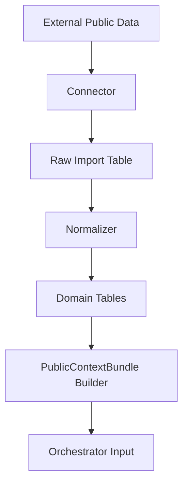

# 공공데이터 활용 전략

확인 기준일: 2026-05-02

## 1. 활용 방향

이 서비스에서 공공데이터는 세 가지 역할을 한다.

```text
1. 콘텐츠 생성 근거: 성취기준, 학교 일정, 시간표를 통해 오늘 학습 목표를 정한다.
2. 상황 맥락 제공: 지역 시설, 교통, 학교 일정을 생활지원형 시나리오 소재로 쓴다.
3. 공모전 설득 근거: 다문화학생, 특수교육, 기초학력 관련 통계로 문제 필요성을 보여준다.
```

중요한 선:

```text
공공데이터만으로 학생 개인을 진단하지 않는다.
공공데이터는 학생별 기록/교사 메모리를 보조하는 맥락 데이터다.
AI 프롬프트에는 원천 데이터 전체가 아니라 필요한 필드만 요약해 넣는다.
```

## 2. 우선순위

| 우선순위 | 데이터 | 이유 |
| --- | --- | --- |
| P0 | NEIS 학교 기본정보/학사일정/시간표 | 학생의 학교 맥락과 오늘 회기 목표 라우팅에 직접 사용 |
| P0 | 국가교육과정/성취기준 | 학습집중형 콘텐츠의 교육과정 근거 |
| P0 | 교육통계서비스/KOSIS 교육통계 | 공모전 문제 정의와 센터 대시보드 근거 |
| P1 | 학교알리미 학교 공시 정보 | 학교 단위 배경 정보, 최근 3년 변화 |
| P1 | 지역 시설/복지/도서관/청소년 시설 표준데이터 | 생활지원형 시나리오 소재 |
| P1 | CareerNet 진로정보 Open API | 생활지원형/학습동기 콘텐츠 소재 |
| P2 | 교통/버스 정류장/도착 정보 | 이동·순서·도움 요청 시나리오 소재 |
| P2 | 정책 문서/보도자료 | 제안서와 심사 발표의 정책 정합성 근거 |

## 3. 데이터 목록

### 3.1 NEIS 교육정보 개방 포털

공식 링크:

```text
https://open.neis.go.kr/
https://open.neis.go.kr/portal/guide/apiIntroPage.do
```

활용 데이터:

| 데이터 | NEIS endpoint 후보 | 핵심 필드 | 활용 |
| --- | --- | --- | --- |
| 학교 기본정보 | `schoolInfo` | 교육청 코드, 학교 코드, 학교명, 주소, 학교급 | 학생 학교 매핑, 학사일정/시간표 조회 키 |
| 학사일정 | `SchoolSchedule` | 일자, 행사명, 학교 코드 | 시험/방학/행사 전후 난이도 조절 |
| 초등학교 시간표 | `elsTimetable` | 학년, 반, 교시, 과목, 일자 | 오늘 과목 기반 미션 추천 |
| 중학교 시간표 | `misTimetable` | 학년, 반, 교시, 과목, 일자 | 학습집중형 과목 라우팅 |
| 고등학교 시간표 | `hisTimetable` | 학년, 반, 교시, 과목, 일자 | 확장 대상 |
| 특수학교 시간표 | `spsTimetable` | 학년, 반, 교시, 과목, 일자 | 생활지원형/특수교육 맥락 확장 |
| 급식식단정보 | `mealServiceDietInfo` | 일자, 식단명, 영양정보 | 선택 기능. 일상 시나리오 소재 |

백엔드 사용 방식:

```text
1. schoolInfo로 학교 코드 매핑
2. 학교 코드로 학사일정/시간표 동기화
3. 학생의 학교/학년/반 정보와 매칭
4. PublicContextBundle에 이번 주 일정과 오늘 과목을 요약
5. 오케스트레이터가 회기 목표와 난이도 조절에 활용
```

예:

```json
{
  "source": "NEIS_SCHOOL_SCHEDULE",
  "schoolCode": "XXXXXXX",
  "weekEvents": [
    { "date": "2026-05-06", "eventName": "중간고사" }
  ],
  "orchestratorHint": "시험 전후이므로 새 개념보다 짧은 복습과 성공경험을 우선한다."
}
```

### 3.2 국가교육과정/성취기준

공식 링크:

```text
https://www.ncic.re.kr/
```

활용 데이터:

| 데이터 | 핵심 필드 | 활용 |
| --- | --- | --- |
| 교육과정 원문 | 학교급, 과목, 영역, 단원 | 콘텐츠 목표의 기준 |
| 성취기준 | 성취기준 코드/문장, 해설 | 학습집중형 stage 1~4의 근거 |
| 평가기준/성취수준 | 상/중/하 수준, 예시 | 난이도 조절 |
| 교수학습 자료 | 활동 예시, 유의점 | 교사용 검토 포인트 |

주의:

```text
NCIC는 구현 시점에 API 제공 범위가 제한될 수 있다.
MVP에서는 성취기준을 CSV/JSON seed 데이터로 적재하고, 출처 URL과 버전을 함께 저장한다.
```

정규화 테이블:

```text
curriculum_standards
- id
- source: NCIC
- curriculum_version
- school_level
- grade_band
- subject
- domain
- unit
- standard_code
- standard_text
- achievement_level_json
- source_url
- effective_from
```

AI 사용 방식:

```text
오케스트레이터가 targetSubject/targetUnit을 성취기준과 연결한다.
ContentGenerator는 해당 성취기준에 맞는 문제/힌트/피드백만 생성한다.
CurriculumValidator가 콘텐츠 목표와 성취기준 불일치를 검수한다.
```

### 3.3 교육통계서비스 KESS / KOSIS

공식 링크:

```text
https://kess.kedi.re.kr/
https://kosis.kr/openapi/
```

활용 데이터:

| 데이터 | 핵심 필드 | 활용 |
| --- | --- | --- |
| 다문화학생 수 | 연도, 학교급, 학생 수, 지역 | 공모전 문제 정의, 지역/전국 추세 카드 |
| 특수교육대상자 현황 | 연도, 장애영역, 학교급, 지역 | 생활지원형 필요성 근거 |
| 기초학력/학업성취 관련 통계 | 연도, 과목, 지역, 수준 | 학습지원 필요성 근거 |
| 학생/학교/학급 기본 통계 | 연도, 학교급, 지역 | 센터 운영 배경 지표 |

사용 방식:

```text
KESS는 통계표/간행물 기반 batch import로 시작한다.
KOSIS OpenAPI로 자동화 가능한 지표는 API 동기화로 전환한다.
교육통계는 학생 개인 추천보다 대시보드/제안서/센터 정책 근거에 우선 사용한다.
```

예시 지표:

```json
{
  "indicator": "multicultural_students_total",
  "year": 2025,
  "value": 202208,
  "source": "KESS",
  "usage": "센터 대시보드 상단 문제 근거 카드"
}
```

### 3.4 학교알리미

공식 링크:

```text
https://www.schoolinfo.go.kr/
```

활용 데이터:

| 데이터 | 핵심 필드 | 활용 |
| --- | --- | --- |
| 학교 공시 기본정보 | 학교명, 주소, 학교급, 설립구분 | 학교 프로필 보강 |
| 학생/교원 현황 | 연도, 학생 수, 교원 수 | 지역/학교 맥락 카드 |
| 교육활동/방과후/돌봄 관련 공시 | 운영 여부, 프로그램 | 센터-학교 연계 아이디어 |

사용 방식:

```text
NEIS가 운영 일정/시간표 중심이라면 학교알리미는 학교의 공시 배경 정보로 쓴다.
MVP에서는 필수 아님. 센터 대시보드의 학교 맥락 보강용으로 P1 처리한다.
```

### 3.5 지역 시설/표준데이터

공식 링크:

```text
https://www.data.go.kr/
```

후보 데이터:

| 데이터 | 핵심 필드 | 활용 |
| --- | --- | --- |
| 전국도서관표준데이터 | 도서관명, 주소, 운영시간, 연락처 | 생활지원형: 도서관 이용/길찾기/도움 요청 |
| 전국지역아동센터표준데이터 | 센터명, 주소, 운영시간 | 지역 돌봄/학습지원 자원 지도 |
| 전국청소년수련시설표준데이터 | 시설명, 프로그램, 주소 | 생활·사회참여 시나리오 |
| 평생학습강좌/문화시설 데이터 | 강좌명, 장소, 대상 | 보호자/지역 연계 추천 |

사용 방식:

```text
영주/경북 지역 필터를 적용해 local_learning_resources에 저장한다.
생활지원형 콘텐츠의 시나리오 소재로 사용한다.
정확한 길찾기나 안전 안내는 외부 지도/교통 서비스와 결합 전까지 일반화된 시나리오로만 쓴다.
```

예:

```json
{
  "scenarioType": "library_visit",
  "publicResource": {
    "name": "영주 지역 도서관",
    "resourceType": "library",
    "source": "DATA_GO_KR_LIBRARY_STANDARD"
  },
  "stageHint": "운영시간, 위치, 도움 요청 문장을 단서 찾기 단계에 사용"
}
```

### 3.6 CareerNet 진로정보 Open API

공식 링크:

```text
https://www.career.go.kr/cnet/front/openapi/openApiMainCenter.do
```

활용 데이터:

| 데이터 | 핵심 필드 | 활용 |
| --- | --- | --- |
| 직업정보 | 직업명, 하는 일, 관련 학과 | 학습 동기 연결 |
| 진로자료 | 제목, 설명, 링크 | 선택형 확장 콘텐츠 |
| 학교/학과 정보 | 학교급, 학과, 지역 | 중장기 진로 미션 |

사용 방식:

```text
학습집중형에서 "왜 이걸 배우는지"를 학생 관심사와 연결할 때 사용한다.
생활지원형에서는 역할극 시나리오의 직업/상황 소재로 사용할 수 있다.
```

### 3.7 교통/버스 데이터

공식 링크:

```text
https://www.data.go.kr/
```

후보 데이터:

| 데이터 | 활용 |
| --- | --- |
| 국토교통부 TAGO 버스정류소정보 | 정류장/노선/이동 시나리오 소재 |
| 버스도착정보 | 시간 확인/기다리기/도움 요청 시나리오 |
| 지역 버스 노선 데이터 | 생활지원형 순서 배열 콘텐츠 |

주의:

```text
실제 학생 이동 안내 서비스로 쓰려면 안전/정확성 검수가 추가로 필요하다.
MVP에서는 현실감 있는 가상 시나리오 소재로만 사용한다.
```

## 4. PublicContextBundle

AI가 직접 원천 데이터를 읽지 않도록 백엔드가 필요한 맥락만 묶어 제공한다.

```json
{
  "studentSchoolContext": {
    "schoolLevel": "middle",
    "grade": 2,
    "todaySubjects": ["수학", "국어"],
    "weekEvents": ["단원평가"]
  },
  "curriculumContext": {
    "source": "NCIC",
    "subject": "수학",
    "unit": "분수",
    "achievementStandard": "전체와 부분의 관계를 분수로 표현한다.",
    "difficultyHint": "foundation"
  },
  "regionalContext": {
    "source": "KESS",
    "indicators": [
      {
        "name": "다문화학생 수",
        "year": 2025,
        "value": 202208
      }
    ]
  },
  "localResourceContext": {
    "resources": [
      {
        "type": "library",
        "displayName": "지역 도서관",
        "usableScenario": "도서관에서 책 찾기와 도움 요청하기"
      }
    ]
  }
}
```

오케스트레이터 사용 예:

```text
학사일정에 시험이 가까움
→ 새 단원보다 복습/성공경험 우선

오늘 시간표에 수학이 있음
→ 수학 학습집중형 콘텐츠 우선 추천

성취기준이 분수의 의미
→ 개념 열기/문제1/문제2/별이에게 설명하기를 분수 전체-부분 관계로 제한

생활지원형 학생이고 지역 도서관 데이터가 있음
→ 도서관에서 책 찾기/도움 요청하기 시나리오 생성
```

## 5. 수집/동기화 구조



테이블:

```text
public_data_sources
- code
- name
- provider
- source_url
- license
- auth_type
- refresh_policy
- enabled

public_data_import_jobs
- source_code
- status
- requested_by
- started_at
- finished_at
- row_count
- checksum
- error_message

public_data_raw_records
- source_code
- external_id
- payload_json
- fetched_at

school_profiles
school_calendar_events
school_timetable_slots
curriculum_standards
education_stat_indicators
local_learning_resources
```

동기화 주기:

| 데이터 | 주기 |
| --- | --- |
| 학교 기본정보 | 월 1회 |
| 학사일정 | 주 1회, 학기 초에는 수동 재동기화 |
| 시간표 | 주 1회 또는 교사 수동 갱신 |
| 성취기준 | 교육과정 버전 변경 시 |
| 교육통계 | 연 1회 또는 통계 갱신 시 |
| 지역 시설 | 월 1회 |
| 교통 데이터 | MVP에서는 수동/샘플, 확장 시 일 단위 |

## 6. AI 프롬프트에 넣는 방식

좋은 방식:

```text
학생은 중2, 최근 분수에서 분모/분자 위치를 헷갈림.
오늘 시간표에 수학이 있고, 이번 주 단원평가가 있음.
성취기준은 "전체와 부분의 관계를 분수로 표현"임.
첫 문제는 쉬운 성공경험으로 시작할 것.
```

피해야 하는 방식:

```text
NEIS 원본 응답 JSON 전체를 그대로 넣기
학생 실명/상담 원문 전체를 넣기
공공통계만 보고 개인의 문제 유형을 단정하기
출처/버전 없는 통계 수치를 화면에 노출하기
```

## 7. 공공데이터 기반 기능 아이디어

### 7.1 교사 대시보드

```text
우리 센터 학생의 문제유형 분포
최근 4주 콘텐츠 완료율
학교 일정 기반 이번 주 주의 학생
다문화/특수교육/기초학력 관련 공공통계 카드
성취기준별 보완 필요 학생 목록
```

### 7.2 학생 콘텐츠

```text
오늘 학교 시간표와 맞는 과목 미션
학교 일정이 바쁜 주에는 3분 복습 미션
지역 도서관/센터/버스정류장 기반 생활 시나리오
성취기준에 맞춘 개념-문제-설명-실시간 연습 흐름
```

### 7.3 공모전 발표 포인트

```text
공공데이터가 단순 시각화에 그치지 않고 AI 콘텐츠 생성의 입력 맥락이 된다.
학교 일정/시간표/성취기준/통계가 학생별 메모리와 결합된다.
교사가 승인한 안전한 콘텐츠만 학생에게 제공된다.
학습지원과 생활지원 두 유형을 모두 다룬다.
```

## 8. MVP 적용 순서

### 1차 적용

```text
NEIS schoolInfo
NEIS SchoolSchedule
NCIC 성취기준 seed JSON
KESS 다문화학생 수 등 핵심 통계 seed JSON
```

### 2차 적용

```text
NEIS 시간표
학교알리미 학교 공시 기본정보
지역 도서관/청소년 시설 표준데이터
```

### 3차 적용

```text
KOSIS OpenAPI 자동 동기화
CareerNet 진로정보
교통/버스 시나리오 데이터
```

## 9. 환경 변수

```text
NEIS_API_KEY=
KOSIS_API_KEY=
CAREERNET_API_KEY=
DATA_GO_KR_API_KEY=
PUBLIC_DATA_SYNC_CRON=
PUBLIC_DATA_CACHE_TTL_SECONDS=
```

## 10. 리스크와 대응

| 리스크 | 대응 |
| --- | --- |
| 공공데이터 API 응답 형식 변경 | raw payload 저장, normalizer version 관리 |
| 학교/학년/반 매핑 오류 | 교사 화면에서 수동 수정 가능 |
| 성취기준 API 부재 | seed JSON으로 시작하고 버전/출처 기록 |
| 통계 수치 업데이트 지연 | last_fetched_at, source_url 표시 |
| 공공데이터로 개인 진단 오남용 | 공공데이터는 맥락/근거로만 사용하도록 정책화 |
| 교통 데이터 정확성 | 실제 길안내가 아닌 가상 시나리오 소재로 제한 |

## 11. 최종 방향

공공데이터 활용의 핵심은 아래 한 문장이다.

```text
NEIS는 오늘의 맥락을 주고, NCIC는 학습 목표의 근거를 주며, KESS/KOSIS는 사회적 필요성을 보여주고, 지역 공공데이터는 생활지원형 시나리오를 현실감 있게 만든다.
```

이 구조를 백엔드에 넣으면 공공데이터가 대시보드 장식이 아니라, 오케스트레이터가 다음 콘텐츠를 결정하는 실제 입력값이 된다.
