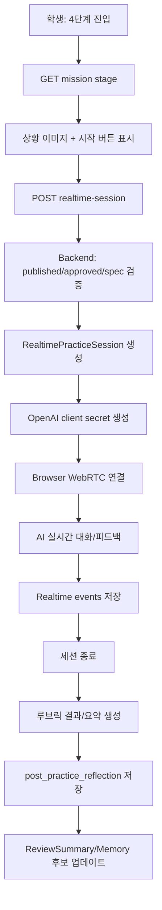

# 4단계 실시간 연습 설계

확인 기준일: 2026-05-02

## 1. 방향

각 콘텐츠 유형의 4단계는 정적 퀴즈가 아니라 `상황 이미지 + AI 실시간 대화 + 즉시 피드백`으로 간다.

핵심은 아래다.

```text
1~3단계: 사전 생성 템플릿 콘텐츠
4단계: 승인된 RealtimePracticeSpec 기반 실시간 연습
종료 후: 짧은 회고와 리뷰 요약
```

중요한 점:

```text
4단계에서만 realtime을 연다.
AI가 새 콘텐츠를 마음대로 생성하지 않는다.
AI는 교사가 승인한 상황, 역할, 첫 질문, 루브릭, 금지 범위 안에서만 대화한다.
실시간 피드백은 학생 경험용이고, 다음 회기 반영은 세션 종료 후 요약으로만 한다.
```

## 2. 공식 API 기준

OpenAI Realtime API는 저지연 멀티모달 앱과 음성 대화 경험을 만드는 용도다. 공식 문서 기준으로 브라우저/클라이언트 상호작용에는 WebRTC가 적합하고, 서버 측 앱에는 WebSocket이 적합하다.

공식 링크:

```text
https://platform.openai.com/docs/guides/realtime
https://platform.openai.com/docs/guides/realtime-server-controls
https://platform.openai.com/docs/api-reference/realtime-sessions
```

구현 방향:

```text
모델: gpt-realtime
브라우저 연결: WebRTC
서버 제어/모니터링: sideband WebSocket 선택 적용
클라이언트 인증: /v1/realtime/client_secrets로 발급한 짧게 유효한 client secret
WebRTC SDP 교환: /v1/realtime/calls
```

## 3. 유형별 4단계

### 3.1 생활지원형

학생 화면 이름:

```text
AI와 연습하기
```

목적:

```text
상황 이미지 속에서 실제로 말해보며 도움 요청, 순서 말하기, 감정 표현, 다음 행동 확인을 연습한다.
```

예시:

```text
상황 이미지: 버스 정류장에서 센터에 가야 하는 장면
AI 역할: 정류장 안내 직원
AI 첫 질문: "어디로 가려고 하나요? 제가 도와줄게요."
학생 목표: "3번 버스를 타고 센터에 가야 해요"라고 말하기
실시간 피드백: "좋아요. 어디로 가는지 말했어요. 이제 어떤 버스를 타야 하는지도 말해볼까요?"
```

루브릭:

| 항목 | 설명 |
| --- | --- |
| `state_destination` | 목적지를 말한다 |
| `ask_help` | 도움을 요청한다 |
| `confirm_next_action` | 다음 행동을 확인한다 |
| `emotion_expression` | 어렵거나 헷갈린 감정을 말한다 |

### 3.2 학습집중형

학생 화면 이름:

```text
AI에게 말해보기
```

목적:

```text
상황 이미지와 별이의 질문을 보고 학생이 개념을 자기 말로 설명한다.
```

예시:

```text
상황 이미지: 4조각 피자 중 1조각이 빛나는 장면
AI 역할: 별이
AI 첫 질문: "왜 4/1이 아니라 1/4인지 알려줄래?"
학생 목표: "전체 4개 중 고른 것이 1개라서 1/4이야"라고 설명하기
실시간 피드백: "좋아요. 전체가 4개라는 말을 넣었어요. 고른 조각이 1개라는 말도 이어서 해볼까요?"
```

루브릭:

| 항목 | 설명 |
| --- | --- |
| `mention_whole` | 전체 개수를 말한다 |
| `mention_part` | 고른 개수를 말한다 |
| `connect_fraction` | 분수 표현으로 연결한다 |
| `fix_misconception` | 분모/분자 위치를 헷갈리지 않게 설명한다 |

## 4. RealtimePracticeSpec

공통 스키마:

```json
{
  "id": "rt_spec_001",
  "stageId": "stage_004",
  "templateType": "realtime_teach_back",
  "imageAssetId": "asset_fraction_001",
  "mode": "voice_or_text",
  "practiceTitle": "별이에게 분수 설명하기",
  "situationText": "별이가 빛나는 피자 조각을 보고 왜 1/4인지 궁금해해요.",
  "aiRole": "별이",
  "openingLine": "왜 4/1이 아니라 1/4인지 알려줄래?",
  "studentGoal": "전체 4개 중 고른 것이 1개라서 1/4이라고 설명하기",
  "rubric": [
    { "id": "mention_whole", "label": "전체가 4개임을 말한다", "required": true },
    { "id": "mention_part", "label": "고른 것이 1개임을 말한다", "required": true },
    { "id": "connect_fraction", "label": "1/4로 연결한다", "required": true }
  ],
  "allowedFeedback": [
    "좋아요. 전체가 몇 개인지 말했어요.",
    "고른 것이 몇 개인지도 말해볼까요?",
    "이제 1/4이라는 표현까지 이어서 말해봐요."
  ],
  "forbidden": [
    "새 문제를 만들지 않기",
    "학생에게 진단 라벨 말하지 않기",
    "상담 기록이나 개인정보 언급하지 않기"
  ],
  "maxTurns": 6,
  "maxDurationSec": 120,
  "postPracticeReflection": ["쉬웠어요", "조금 헷갈렸어요", "다시 연습하고 싶어요"]
}
```

## 5. 런타임 아키텍처



## 6. Backend API

### 6.1 세션 생성

```http
POST /api/student/missions/:contentId/stages/:stageId/realtime-session
```

서버 검증:

```text
content.status가 published 또는 in_progress인가
stage.step이 4인가
stage.templateType이 realtime_roleplay 또는 realtime_teach_back인가
교사가 승인한 realtime_spec_json이 존재하는가
학생이 해당 콘텐츠에 접근 가능한가
동시 세션이 이미 열려 있지 않은가
```

응답:

```json
{
  "sessionId": "rt_session_001",
  "provider": "openai",
  "model": "gpt-realtime",
  "clientSecret": "ek_...",
  "expiresAt": "2026-05-02T10:20:00.000Z",
  "webrtcUrl": "https://api.openai.com/v1/realtime/calls",
  "practiceSpec": {
    "practiceTitle": "별이에게 분수 설명하기",
    "imageAssetUrl": "https://storage.example.com/assets/fraction.png",
    "openingLine": "왜 4/1이 아니라 1/4인지 알려줄래?",
    "maxTurns": 6,
    "maxDurationSec": 120
  }
}
```

### 6.2 이벤트 저장

```http
POST /api/student/realtime-sessions/:sessionId/events
```

대표 이벤트:

```text
realtime_session_started
realtime_user_turn
realtime_ai_feedback
realtime_rubric_signal
realtime_session_completed
realtime_session_failed
```

### 6.3 세션 종료

```http
POST /api/student/realtime-sessions/:sessionId/complete
```

저장 결과:

```json
{
  "status": "completed",
  "turnCount": 4,
  "durationSec": 78,
  "rubricResult": {
    "passed": ["mention_whole", "mention_part"],
    "needsSupport": ["connect_fraction"]
  },
  "transcriptSummary": "전체와 부분은 말했지만 1/4 표현으로 연결하는 데 한 번 더 도움이 필요했습니다."
}
```

## 7. Realtime Instructions 생성

백엔드는 승인된 `RealtimePracticeSpec`을 아래처럼 instructions로 변환한다.

```text
당신은 별이입니다.
학생은 분수의 전체-부분 관계를 연습하고 있습니다.
상황: 별이가 빛나는 피자 조각을 보고 왜 1/4인지 궁금해합니다.
첫 질문: "왜 4/1이 아니라 1/4인지 알려줄래?"
목표: 학생이 전체 4개, 고른 것 1개, 1/4 표현을 말하도록 돕습니다.
허용 피드백: 짧고 격려하는 말, 빠진 핵심 요소를 묻는 말.
금지: 새 문제 생성, 진단 라벨 언급, 개인정보 언급, 긴 강의.
대화 제한: 최대 6턴, 최대 120초.
```

실시간 단계의 AI는 아래만 해야 한다.

```text
첫 질문 던지기
학생 답변을 듣고 루브릭 요소가 있는지 확인
빠진 요소를 짧게 다시 질문
완료되면 칭찬하고 마무리
```

## 8. 교사 검토 화면

교사는 4단계 실시간 연습에 대해 아래를 승인한다.

```text
상황 이미지
AI 역할
첫 질문
학생 목표 문장
루브릭
허용 피드백 문장
금지 범위
최대 턴 수/시간
세션 종료 후 회고 버튼
```

교사 수정 가능 항목:

```text
첫 질문 문구
학생 목표
루브릭 required 여부
허용 피드백
시간 제한
음성 사용 여부
텍스트 fallback 여부
```

## 9. 저장 정책

원칙:

```text
원본 음성 파일은 기본 저장하지 않는다.
대화 전문도 기본 저장하지 않고, 요약과 루브릭 결과를 우선 저장한다.
문제 재현/검수 필요 시에만 제한 기간 transcript를 저장한다.
학생/보호자 동의 범위 안에서만 음성/전사 데이터를 보존한다.
```

DB:

```text
realtime_practice_sessions
- id
- student_id
- mission_content_id
- stage_id
- status
- provider
- model
- started_at
- ended_at
- turn_count
- duration_sec
- rubric_result_json
- transcript_summary
- post_practice_reflection_json

realtime_practice_events
- id
- session_id
- event_type
- payload_json
- occurred_at
```

## 10. 안전장치

필수:

```text
client에는 OpenAI API key를 절대 전달하지 않는다.
client secret은 짧은 만료 시간을 가진다.
동시 세션 제한을 둔다.
학생별 하루 realtime 사용량을 제한한다.
AI instructions에는 원본 상담 메모를 넣지 않는다.
세션 중 위험 발화가 감지되면 교사에게 알림 후보로 남긴다.
학생에게 낙인성 진단 표현을 하지 않는다.
```

장애 대응:

```text
마이크 권한 실패: 텍스트 입력 fallback
Realtime 연결 실패: 정적 roleplay_simulation fallback
세션 중 끊김: 같은 spec으로 1회 재연결
시간 초과: AI가 마무리 멘트 후 종료
```

## 11. MVP 범위

1차 MVP:

```text
텍스트 + 음성 입력 중 하나 선택
WebRTC 기반 realtime session 생성
2분/6턴 제한
루브릭 결과 수동/간단 자동 저장
post-practice 회고 버튼
교사 승인 화면에 realtime spec 미리보기
```

2차:

```text
서버 sideband WebSocket으로 세션 모니터링
rubric signal 자동 추출
비용/시간 모니터링
생활지원형 NPC 역할 확장
학습집중형 단원별 teach-back 루브릭 확장
```

## 12. 결론

이 단계는 서비스의 데모 임팩트를 만드는 지점이다.

```text
앞의 단계에서 아이가 안전하게 준비하고,
마지막 단계에서 AI와 실제로 말해보며,
그 결과가 다음 회기 메모리로 이어진다.
```

그래서 마지막 단계의 본질은 `자유 대화 챗봇`이 아니라 **교사가 승인한 상황 안에서 실행되는 실시간 연습실**이다.
