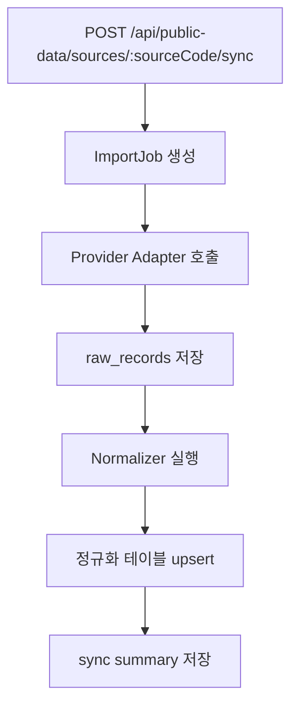

# Public Data API Requirements

확인 기준일: 2026-05-02

## 1. 사용 방향

공공데이터는 학생을 자동 진단하기 위한 데이터가 아니다. 이 프로젝트에서는 아래 용도로 사용한다.

- 학교 일정/시간표를 반영해 이번 주 학습 부담을 조절한다.
- 성취기준과 단원 정보를 연결해 AI 콘텐츠의 교육과정 근거를 만든다.
- 영주/경북 지역 교육 환경, 다문화/기초학력/학교 자원 통계를 발표 근거로 사용한다.
- 지역 학습 지원 자원과 진로/생활 자료를 콘텐츠 시나리오 소재로 사용한다.

개인정보와 공공데이터를 직접 결합해 낙인성 판단을 만들지 않는다.

## 2. 우선순위

| 우선순위 | 데이터 | 사용 위치 |
| --- | --- | --- |
| P0 | 학교 기본정보, 학사일정, 시간표 | 콘텐츠 생성 컨텍스트, 교사 대시보드 |
| P0 | 교육과정/성취기준 seed | 콘텐츠 목표, 교사 검토 근거 |
| P1 | 학교알리미 학교 공시 | 학교 환경 맥락, 발표 근거 |
| P1 | KESS/KOSIS 교육통계 | 공모전 문제 정의, 지역/학교급 통계 |
| P2 | 지역 학습시설/도서관/청소년시설 | 생활지원형 시나리오 소재 |
| P2 | 커리어넷 진로교육자료 | 중등 학생 진로/동기 콘텐츠 |
| P3 | 교통/버스 정보 | 생활지원형 이동 시나리오 확장 |

## 3. Source Registry

| sourceCode | 공식 출처 | 인증 | 동기화 | 주요 필드 | 비고 |
| --- | --- | --- | --- | --- | --- |
| `neis_open_api` | [나이스 교육정보 개방 포털](https://open.neis.go.kr/) | API key | 매일/수동 | 학교코드, 학교명, 학사일정, 시간표 | NEIS는 Open API 서비스를 제공하며 인증키 발급 후 사용한다. |
| `schoolinfo_api` | [학교알리미 Open API](https://www.schoolinfo.go.kr/ng/go/pnnggo_a01_m0.do) | API key | 월간/수동 | 학교기본정보, 학생/시설/상담/도서관 등 공시 항목 | 학교알리미는 API 이용 절차와 제공목록을 별도 제공한다. |
| `kess_stats` | [교육통계서비스 KESS](https://kess.kedi.re.kr/main.do) | 항목별 확인 | 분기/수동 | 다문화학생, 학교급별 개황, 지역 통계 | KESS는 통계/간행물 중심이다. API 여부는 구현 전 최종 확인한다. |
| `kosis_stats` | [KOSIS 국가통계포털](https://kosis.kr/) | API key | 분기/수동 | 지역 인구, 교육 관련 보조 통계 | 발표 근거와 지역 맥락 보강용. |
| `curriculum_seed` | 교육부/교육과정 공식 문서 | 파일/수동 seed | 개정 시 | 과목, 학교급, 단원, 성취기준 | 안정성을 위해 MVP는 검증된 seed 파일로 시작한다. |
| `career_net` | [커리어넷 Open API 센터](https://www.career.go.kr/cnet/front/openapi/openApiMainCenter.do) | API key | 월간/수동 | 학교정보, 진로교육자료 | 학습집중형 동기/진로 시나리오에 선택 활용. |
| `local_facilities` | 공공데이터포털/지자체 | API key 또는 파일 | 월간/수동 | 도서관, 청소년시설, 평생학습관 | 생활지원형 콘텐츠 소재. |
| `transport_optional` | 공공데이터포털/교통 API | API key | 필요 시 | 정류장, 노선, 도착정보 | 데모에서는 실제 실시간 교통 의존도를 낮춘다. |

## 4. 환경 변수

```text
NEIS_API_KEY=
SCHOOLINFO_API_KEY=
KOSIS_API_KEY=
CAREER_NET_API_KEY=
DATA_GO_KR_API_KEY=
PUBLIC_DATA_SYNC_ENABLED=false
PUBLIC_DATA_REGION_CODE=47210
PUBLIC_DATA_DEFAULT_OFFICE_CODE=R10
```

영주 지역 코드는 구현 전 행정표준코드와 API별 지역 코드 체계를 확인한다.

## 5. Normalized Tables

공공데이터는 원본 응답을 그대로 도메인 테이블에 섞지 않는다.

```text
public_data_sources
public_data_import_jobs
public_data_raw_records
school_profiles
school_calendar_events
school_timetable_slots
curriculum_standards
education_stat_indicators
local_learning_resources
```

원본 응답은 `public_data_raw_records.raw_json`에 저장하고, 앱에서 쓰는 필드만 정규화 테이블로 옮긴다.

## 6. NEIS Usage

사용 후보:

- 학교 기본정보 검색
- 학사일정
- 시간표
- 급식은 MVP 핵심이 아니므로 제외

백엔드 사용 예:

```text
학생 school_code 확인
→ 이번 주 학사일정 조회
→ 시험/행사/방학 여부를 OrchestratorContext에 반영
→ 콘텐츠 난이도와 분량 조절
```

정규화 필드:

```json
{
  "schoolCode": "string",
  "officeCode": "string",
  "schoolName": "string",
  "eventDate": "2026-05-02",
  "eventName": "단원평가",
  "source": "neis_open_api"
}
```

## 7. SchoolInfo Usage

사용 후보:

- 학교기본정보
- 방과후학교 운영/지원현황
- 학교도서관 현황
- 학생/학부모 상담계획 및 실시 현황
- 직원 현황

백엔드 사용 예:

```text
교사가 학생 학교를 등록
→ 학교알리미 기본정보/지원자원 확인
→ 교사 대시보드의 학교 맥락 카드에 표시
→ 콘텐츠 생성 프롬프트에는 요약된 공공 맥락만 전달
```

주의:

```text
학교 단위 공시 정보로 학생 개인 상태를 추론하지 않는다.
민감한 학교 비교/순위 표현을 학생 화면에 노출하지 않는다.
```

## 8. KESS/KOSIS Usage

사용 후보:

- 연도별 다문화 학생 수/비율
- 학교급별 학생 수, 학급 수, 교원 수
- 지역별 교육 지표

사용 위치:

```text
공모전 배경 설명
센터 필요성 근거
교사용 리포트의 지역 맥락
```

MVP에서는 KESS/KOSIS 실시간 조회보다 검증된 snapshot seed를 권장한다. 공식 API와 파일 다운로드 정책은 구현 직전 확인한다.

## 9. Curriculum Seed

성취기준은 안정성이 중요하므로 MVP에서는 API 의존보다 seed JSON을 먼저 둔다.

```json
{
  "curriculum": "2022_revised",
  "schoolLevel": "middle",
  "gradeBand": "1-3",
  "subject": "math",
  "unit": "fractions",
  "achievementStandardCode": "MATH-FRAC-001",
  "achievementStandardText": "전체와 부분의 관계를 분수로 표현할 수 있다.",
  "keywords": ["분수", "전체", "부분", "분모", "분자"]
}
```

## 10. Sync Job 설계



Job 상태:

```text
pending
running
succeeded
failed
partial_failed
cancelled
```

## 11. Provider Adapter Interface

```ts
type PublicDataProviderAdapter = {
  sourceCode: string;
  fetch(params: Record<string, unknown>): Promise<RawPublicDataRecord[]>;
  normalize(record: RawPublicDataRecord): Promise<NormalizedPublicDataRecord[]>;
  validate(record: NormalizedPublicDataRecord): PublicDataValidationResult;
};
```

## 12. Demo Fallback

API 키가 없어도 데모가 멈추면 안 된다.

```text
seed/public-data/schools.yeongju.sample.json
seed/public-data/curriculum.math.sample.json
seed/public-data/education-stats.sample.json
seed/public-data/local-resources.sample.json
```

실제 API 동기화는 `PUBLIC_DATA_SYNC_ENABLED=true`일 때만 수행한다.

## 13. Implementation Cautions

- provider별 요청 제한, 응답 포맷, 인증 방식은 구현 직전 공식 포털에서 재확인한다.
- 원본 raw JSON과 정규화 결과를 모두 저장해 재처리 가능하게 한다.
- 공공데이터는 `sourceCode`, `sourceUrl`, `retrievedAt`, `licenseNote`를 함께 저장한다.
- 발표용 수치에는 기준일과 출처를 반드시 표시한다.
