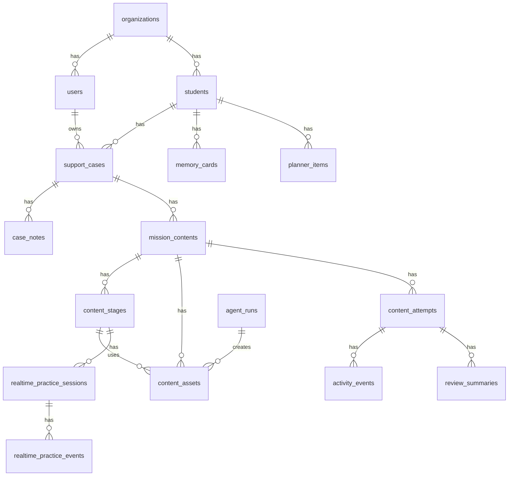

# Database Schema Spec

확인 기준일: 2026-05-02

## 1. 설계 원칙

- PostgreSQL 기준으로 설계한다.
- AI 생성물, 교사 승인, 학생 활동, 메모리 업데이트는 모두 버전/상태를 가진다.
- 원본 공공데이터와 정규화 데이터를 분리한다.
- 학생 개인정보, AI prompt, realtime transcript는 최소 저장 원칙을 적용한다.
- 구현 시 SQLAlchemy model 또는 SQL migration의 source of truth는 이 문서와 맞춰야 한다.

## 2. 핵심 ERD



## 3. Organizations And Users

### organizations

| 필드 | 타입 | 설명 |
| --- | --- | --- |
| `id` | uuid pk | 조직 ID |
| `external_key` | text unique | seed/import 중복 방지 키 |
| `name` | text | 센터/학교명 |
| `type` | text | `learning_support_center`, `school`, `demo` |
| `region_code` | text nullable | 행정/교육청 코드 |
| `created_at` | timestamptz | 생성일 |
| `updated_at` | timestamptz | 수정일 |

### users

| 필드 | 타입 | 설명 |
| --- | --- | --- |
| `id` | uuid pk | 사용자 ID |
| `organization_id` | uuid fk | 소속 조직 |
| `email` | text unique nullable | 교사/관리자 로그인 |
| `display_name` | text | 화면 이름 |
| `role` | text | `center_admin`, `teacher`, `content_reviewer`, `guardian` |
| `password_hash` | text nullable | 로컬 로그인 사용 시 |
| `status` | text | `active`, `invited`, `disabled` |
| `created_at` | timestamptz | 생성일 |

### student_accounts

| 필드 | 타입 | 설명 |
| --- | --- | --- |
| `id` | uuid pk | 학생 로그인 계정 |
| `student_id` | uuid fk | 학생 |
| `access_code_hash` | text | 데모/간편 로그인 코드 해시 |
| `status` | text | `active`, `disabled` |
| `last_login_at` | timestamptz nullable | 마지막 로그인 |

## 4. Students And Cases

### students

| 필드 | 타입 | 설명 |
| --- | --- | --- |
| `id` | uuid pk | 학생 ID |
| `organization_id` | uuid fk | 관리 조직 |
| `external_key` | text unique nullable | seed 키 |
| `display_name` | text | 데모용 가명 권장 |
| `grade` | text | `elementary_6`, `middle_2` 등 |
| `school_code` | text nullable | NEIS/학교알리미 연결 |
| `student_type` | text | `life_support`, `learning_focus` |
| `primary_need` | text | 현재 주요 지원 필요 |
| `profile_json` | jsonb | 관심사, 선호, 접근성 설정 |
| `status` | text | `active`, `archived` |
| `created_at` | timestamptz | 생성일 |

인덱스:

```text
idx_students_org_type(organization_id, student_type)
idx_students_school_code(school_code)
```

### support_cases

| 필드 | 타입 | 설명 |
| --- | --- | --- |
| `id` | uuid pk | 사례 ID |
| `student_id` | uuid fk | 학생 |
| `owner_teacher_id` | uuid fk users | 담당 교사 |
| `case_status` | text | `open`, `paused`, `closed` |
| `current_goal` | text | 코칭 목표 |
| `opened_at` | timestamptz | 시작일 |
| `closed_at` | timestamptz nullable | 종료일 |

### case_notes

| 필드 | 타입 | 설명 |
| --- | --- | --- |
| `id` | uuid pk | 메모 ID |
| `case_id` | uuid fk | 사례 |
| `author_id` | uuid fk users | 작성자 |
| `note_type` | text | `consultation`, `session`, `teacher_comment`, `guardian` |
| `body` | text | 메모 본문 |
| `visibility` | text | `teacher_only`, `center`, `guardian_summary` |
| `created_at` | timestamptz | 생성일 |

## 5. Memory

### memory_cards

| 필드 | 타입 | 설명 |
| --- | --- | --- |
| `id` | uuid pk | 메모리 카드 |
| `student_id` | uuid fk | 학생 |
| `case_id` | uuid fk nullable | 사례 |
| `version` | int | 버전 |
| `learning_problem_types` | text[] | 학습문제 유형 |
| `recent_4w_response_json` | jsonb | 최근 4주 반응 |
| `emotional_state_note` | text nullable | 정서 상태 메모 |
| `effective_explanation_styles` | text[] | 잘 반응한 설명 방식 |
| `frequent_blocking_units` | text[] | 자주 막히는 과목/단원 |
| `guardian_cooperation_status` | text nullable | 보호자 협조 상태 |
| `next_session_cautions` | text[] | 다음 회기 주의점 |
| `teacher_verified_at` | timestamptz nullable | 교사 확인일 |
| `status` | text | `active`, `superseded` |

### memory_snapshots

| 필드 | 타입 | 설명 |
| --- | --- | --- |
| `id` | uuid pk | 압축 스냅샷 |
| `student_id` | uuid fk | 학생 |
| `source_range_json` | jsonb | 반영한 로그 범위 |
| `summary_json` | jsonb | 오케스트레이터 입력용 요약 |
| `created_by_agent_run_id` | uuid fk nullable | 생성 agent run |
| `created_at` | timestamptz | 생성일 |

## 6. Mission Content

### mission_contents

| 필드 | 타입 | 설명 |
| --- | --- | --- |
| `id` | uuid pk | 콘텐츠 패키지 |
| `case_id` | uuid fk | 사례 |
| `student_id` | uuid fk | 학생 |
| `created_by_user_id` | uuid fk users nullable | 요청 교사 |
| `orchestrator_run_id` | uuid fk agent_runs nullable | 생성 실행 |
| `content_type` | text | `life_support`, `learning_focus` |
| `title` | text | 학생용 제목 |
| `session_goal` | text | 오늘 회기 목표 |
| `status` | text | `draft`, `generating`, `teacher_review`, `revision_requested`, `approved`, `published`, `archived` |
| `total_steps` | int | 항상 4 |
| `brief_json` | jsonb | 콘텐츠 브리프 |
| `teacher_review_summary` | text nullable | 교사용 요약 |
| `approved_by_user_id` | uuid fk nullable | 승인자 |
| `approved_at` | timestamptz nullable | 승인일 |
| `published_at` | timestamptz nullable | 배포일 |

인덱스:

```text
idx_mission_contents_student_status(student_id, status)
idx_mission_contents_case_created(case_id, created_at desc)
```

### content_stages

| 필드 | 타입 | 설명 |
| --- | --- | --- |
| `id` | uuid pk | 단계 ID |
| `mission_content_id` | uuid fk | 콘텐츠 |
| `step` | int | 1, 2, 3, 4 |
| `stage_role` | text | `scenario_intro`, `basic_problem`, `realtime_practice` 등 |
| `template_type` | text | 렌더링 템플릿 |
| `student_title` | text | 단계명 |
| `student_instruction` | text | 지시문 |
| `template_json` | jsonb | 선택지/정답/힌트 등 |
| `realtime_spec_json` | jsonb nullable | 4단계일 때만 |
| `sort_order` | int | 정렬 |

제약:

```text
mission_content_id + step unique
step between 1 and 4
step=4이면 template_type in ('realtime_roleplay','realtime_teach_back')
```

### content_assets

| 필드 | 타입 | 설명 |
| --- | --- | --- |
| `id` | uuid pk | asset ID |
| `mission_content_id` | uuid fk | 콘텐츠 |
| `stage_id` | uuid fk nullable | 단계 |
| `asset_role` | text | `hero`, `stage_1`, `stage_2`, `stage_3`, `stage_4_realtime` |
| `asset_type` | text | `image`, `audio_optional` |
| `provider` | text | `openai`, `elevenlabs_optional` |
| `model` | text | `gpt-image-2` 등 |
| `prompt_json` | jsonb nullable | 이미지 프롬프트 브리프 |
| `storage_url` | text | object storage path |
| `preview_url` | text nullable | 미리보기 URL |
| `qa_status` | text | `pending`, `passed`, `failed` |
| `approval_status` | text | `pending`, `approved`, `rejected` |
| `created_at` | timestamptz | 생성일 |

## 7. Student Runtime

### content_attempts

| 필드 | 타입 | 설명 |
| --- | --- | --- |
| `id` | uuid pk | 플레이 시도 |
| `mission_content_id` | uuid fk | 콘텐츠 |
| `student_id` | uuid fk | 학생 |
| `status` | text | `in_progress`, `completed`, `abandoned` |
| `current_step` | int | 진행 단계 |
| `started_at` | timestamptz | 시작 |
| `completed_at` | timestamptz nullable | 완료 |
| `score_json` | jsonb nullable | 정답률/보상 |

### activity_events

| 필드 | 타입 | 설명 |
| --- | --- | --- |
| `id` | uuid pk | 이벤트 |
| `attempt_id` | uuid fk | 시도 |
| `student_id` | uuid fk | 학생 |
| `stage_id` | uuid fk nullable | 단계 |
| `event_type` | text | `stage_viewed`, `answer_submitted`, `hint_used`, `post_practice_reflection` |
| `payload_json` | jsonb | 이벤트 payload |
| `occurred_at` | timestamptz | 발생시각 |

## 8. Realtime

### realtime_practice_sessions

| 필드 | 타입 | 설명 |
| --- | --- | --- |
| `id` | uuid pk | 세션 |
| `attempt_id` | uuid fk | 콘텐츠 시도 |
| `mission_content_id` | uuid fk | 콘텐츠 |
| `stage_id` | uuid fk | 4단계 |
| `student_id` | uuid fk | 학생 |
| `provider` | text | `openai` |
| `model` | text | `gpt-realtime` |
| `status` | text | `created`, `active`, `completed`, `failed`, `expired` |
| `spec_snapshot_json` | jsonb | 승인된 RealtimePracticeSpec 스냅샷 |
| `started_at` | timestamptz nullable | 시작 |
| `ended_at` | timestamptz nullable | 종료 |
| `turn_count` | int | 턴 수 |
| `duration_sec` | int | 진행 시간 |
| `rubric_result_json` | jsonb nullable | 루브릭 결과 |
| `transcript_summary` | text nullable | 요약 |

### realtime_practice_events

| 필드 | 타입 | 설명 |
| --- | --- | --- |
| `id` | uuid pk | 이벤트 |
| `session_id` | uuid fk | realtime session |
| `event_type` | text | `started`, `user_turn`, `ai_feedback`, `rubric_signal`, `completed`, `failed` |
| `payload_json` | jsonb | 최소 payload |
| `occurred_at` | timestamptz | 발생시각 |

## 9. Review And Planner

### review_summaries

| 필드 | 타입 | 설명 |
| --- | --- | --- |
| `id` | uuid pk | 리뷰 요약 |
| `attempt_id` | uuid fk | 플레이 시도 |
| `student_id` | uuid fk | 학생 |
| `agent_run_id` | uuid fk nullable | ReviewAgent 실행 |
| `completion_rate` | numeric | 완료율 |
| `accuracy_rate` | numeric | 정답률 |
| `short_summary` | text | 짧은 요약 |
| `wrong_pattern_json` | jsonb | 오답 패턴 |
| `realtime_result_json` | jsonb | 4단계 결과 |
| `memory_update_candidate_json` | jsonb | 메모리 반영 후보 |
| `planner_update_candidate_json` | jsonb | 계획 반영 후보 |
| `applied_to_memory_at` | timestamptz nullable | 반영일 |

### planner_items

| 필드 | 타입 | 설명 |
| --- | --- | --- |
| `id` | uuid pk | 계획 항목 |
| `student_id` | uuid fk | 학생 |
| `case_id` | uuid fk | 사례 |
| `period_type` | text | `weekly`, `monthly`, `next_session` |
| `goal_text` | text | 목표 |
| `checklist_json` | jsonb | 코칭단 체크 항목 |
| `status` | text | `planned`, `done`, `skipped` |

## 10. Public Data

### public_data_sources

| 필드 | 타입 | 설명 |
| --- | --- | --- |
| `id` | uuid pk | source |
| `source_code` | text unique | `neis_open_api` 등 |
| `name` | text | 표시명 |
| `base_url` | text nullable | 공식 URL |
| `auth_type` | text | `api_key`, `none`, `manual_seed` |
| `enabled` | boolean | 활성화 |

### public_data_import_jobs

| 필드 | 타입 | 설명 |
| --- | --- | --- |
| `id` | uuid pk | job |
| `source_id` | uuid fk | source |
| `status` | text | `pending`, `running`, `succeeded`, `failed`, `partial_failed` |
| `params_json` | jsonb | 요청 파라미터 |
| `started_at` | timestamptz nullable | 시작 |
| `finished_at` | timestamptz nullable | 종료 |
| `summary_json` | jsonb nullable | 결과 |

### public_data_raw_records

| 필드 | 타입 | 설명 |
| --- | --- | --- |
| `id` | uuid pk | raw record |
| `source_id` | uuid fk | source |
| `import_job_id` | uuid fk | job |
| `external_id` | text nullable | 원본 ID |
| `raw_json` | jsonb | 원본 응답 |
| `retrieved_at` | timestamptz | 수집시각 |

정규화 테이블:

```text
school_profiles
school_calendar_events
school_timetable_slots
curriculum_standards
education_stat_indicators
local_learning_resources
```

## 11. AI Runs And Audit

### agent_runs

| 필드 | 타입 | 설명 |
| --- | --- | --- |
| `id` | uuid pk | 실행 ID |
| `agent_type` | text | `orchestrator`, `content`, `image_prompt`, `review`, `memory` |
| `student_id` | uuid fk nullable | 학생 |
| `mission_content_id` | uuid fk nullable | 콘텐츠 |
| `input_snapshot_json` | jsonb | 입력 스냅샷 |
| `output_json` | jsonb nullable | 출력 |
| `model_name` | text | 모델 |
| `status` | text | `running`, `succeeded`, `failed` |
| `error_message` | text nullable | 오류 |
| `created_at` | timestamptz | 생성 |
| `completed_at` | timestamptz nullable | 완료 |

### audit_logs

| 필드 | 타입 | 설명 |
| --- | --- | --- |
| `id` | uuid pk | 감사 로그 |
| `actor_user_id` | uuid fk nullable | 사용자 |
| `student_id` | uuid fk nullable | 대상 학생 |
| `action` | text | `view_student`, `approve_content`, `update_memory` 등 |
| `resource_type` | text | 리소스 |
| `resource_id` | uuid nullable | 리소스 ID |
| `payload_json` | jsonb nullable | 변경 요약 |
| `created_at` | timestamptz | 생성 |

### consent_records

| 필드 | 타입 | 설명 |
| --- | --- | --- |
| `id` | uuid pk | 동의 기록 |
| `student_id` | uuid fk | 학생 |
| `consent_type` | text | `personal_data`, `ai_content`, `voice_optional` |
| `status` | text | `granted`, `revoked`, `pending` |
| `granted_by` | text nullable | 보호자/센터 |
| `recorded_at` | timestamptz | 기록일 |

## 12. Status Enums

```text
MissionContent.status:
draft, generating, teacher_review, revision_requested, approved, published, archived

ContentAsset.asset_role:
hero, stage_1, stage_2, stage_3, stage_4_realtime

Student.student_type:
life_support, learning_focus

RealtimePracticeSession.status:
created, active, completed, failed, expired
```

## 13. Implementation Order

1. Organizations/users/students/support_cases
2. memory_cards/case_notes
3. mission_contents/content_stages/content_assets
4. content_attempts/activity_events
5. realtime_practice_sessions/events
6. review_summaries/planner_items
7. public_data tables
8. agent_runs/audit_logs/consent_records
