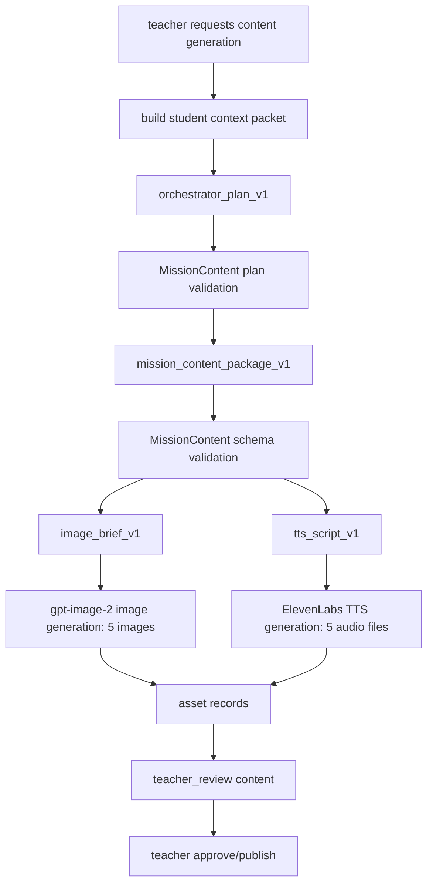

# AI 오케스트레이터 Workflow 구현 계획

확인 기준일: 2026-05-02

## 1. 현재 결론

프롬프트와 실행 프레임워크는 아래처럼 고정한다.

```text
FastAPI service layer
→ 자체 workflow orchestrator
→ OpenAI Responses API adapter
→ strict structured JSON validation
→ DB AgentRun 저장
→ Image API / TTS / Realtime adapter 분리
```

MVP에서는 LangChain 같은 범용 agent 프레임워크를 쓰지 않는다.
프롬프트, schema, 저장, 승인 흐름을 직접 통제해야 하고, 프론트가 기대하는 `MissionContent` 계약이 매우 엄격하기 때문이다.

OpenAI Agents SDK는 추적, handoff, 도구 호출이 많아지는 시점에 검토한다.
현재는 agent 역할을 코드 모듈과 prompt version으로 나누고, 모든 실행을 `agent_runs`에 저장하는 방식이 더 단순하고 안전하다.

## 2. 근거

- OpenAI Responses API는 새 프로젝트에서 text/image input, structured JSON output, tool/function calling 흐름을 한 API로 다루는 기본 인터페이스다.
- Structured Outputs는 단순 JSON mode보다 schema adherence를 보장하므로, 프론트 렌더링용 `MissionContent` 생성에 적합하다.
- Agents SDK는 handoff, tool, trace가 많은 agentic app에 좋지만, MVP의 핵심은 다중 agent 자율성이 아니라 교사 승인 가능한 deterministic content package다.

## 3. 프롬프트 파일 위치

실제 prompt version은 코드에 하드코딩하지 않는다.

```text
backend/app/ai/prompts/orchestrator_plan_v1.md
backend/app/ai/prompts/mission_content_package_v1.md
backend/app/ai/prompts/image_brief_v1.md
backend/app/ai/prompts/tts_script_v1.md
```

Registry:

```text
backend/app/ai/prompt_registry.py
```

각 AI 실행은 아래를 저장한다.

```text
agent_type
prompt_version
output_schema_name
input_snapshot
output_json
model
status
token_usage
error_message
```

## 4. 실행 순서



## 5. Agent 역할

| agent_type | prompt version | 역할 | 출력 |
| --- | --- | --- | --- |
| `orchestrator` | `orchestrator_plan_v1` | 학생에게 다음 회기에 무엇이 필요한지 결정 | `OrchestratorPlanV1` |
| `content` | `mission_content_package_v1` | 4단계 콘텐츠 JSON 초안 생성 | `MissionContentPackageV1` |
| `image_prompt` | `image_brief_v1` | 5개 이미지 생성 프롬프트 작성 | `ImageBriefPackageV1` |
| `tts_script` | `tts_script_v1` | 5개 안내 음성 script 작성 | `TtsScriptPackageV1` |

## 6. 중요한 생성 원칙

이미지는 상황 설명용이다.

```text
이미지: 장면, 물체, 관계, 감정, 마스코트 반응
templateJson: 문제 문장, 선택지, 카드 텍스트, 빈칸, 힌트, 정답 피드백
audio: templateJson/studentInstruction 기반 stage 진입 안내 음성
```

따라서 image prompt에는 문제 문장, 선택지, 정답, 힌트, 긴 한글 설명을 넣지 않는다.

## 7. 모델/Provider 분리

```text
Reasoning/content JSON: OpenAI Responses API
Image: configured OPENAI_IMAGE_MODEL, 기본 gpt-image-2
Realtime: OPENAI_REALTIME_MODEL
TTS: ElevenLabs
```

프론트에는 provider secret을 절대 내려주지 않는다.

## 8. 다음 구현 슬라이스

1. `AgentRun` DB model/repository 보강
2. Responses API adapter 추가
3. `POST /api/ai/orchestrator-runs` 구현
4. `POST /api/ai/content-generations` 구현
5. mock provider로 schema validation 먼저 통과
6. 실제 OpenAI/ElevenLabs adapter 연결
