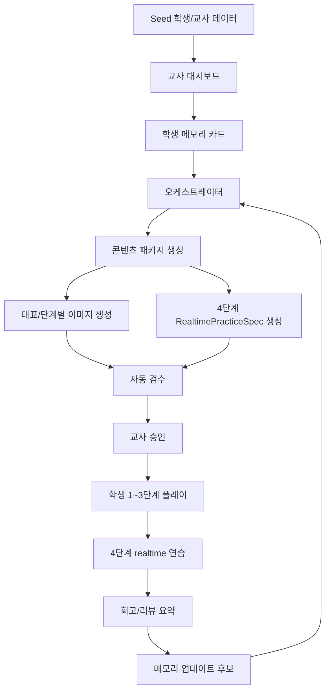

# 에이전트 문서 지도

레포를 처음 여는 에이전트는 이 문서로 작업 문서를 찾는다.

## 읽는 순서

1. [../../AGENTS.md](../../AGENTS.md) - 전체 작업 규칙
2. [../../GOAL.md](../../GOAL.md) - 장기 목표와 마일스톤
3. [03-implementation-backlog.md](03-implementation-backlog.md) - 지금 할 일
4. [01-collaboration-contract.md](01-collaboration-contract.md) - 프론트/백엔드 협업 규칙
5. 현재 작업과 관련된 상세 문서

## 폴더별 역할

| 폴더 | 역할 |
| --- | --- |
| `docs/common/` | 프론트와 백엔드가 함께 지켜야 하는 제품/콘텐츠/API/협업 계약 |
| `docs/frontend/` | 프론트 팀원이 화면 구현 전에 보는 문서 |
| `docs/backend/` | 백엔드 팀원이 API, DB, AI workflow 구현 전에 보는 문서 |

## 작업별로 볼 문서

| 작업 주제 | 먼저 볼 문서 | 같이 볼 문서 |
| --- | --- | --- |
| 프론트 신규 작업 | [../frontend/00-frontend-team-guide.md](../frontend/00-frontend-team-guide.md) | [02-branch-handoff-contract.md](02-branch-handoff-contract.md), [08-rest-api-spec.md](08-rest-api-spec.md) |
| 백엔드 신규 작업 | [../backend/00-backend-team-guide.md](../backend/00-backend-team-guide.md) | [03-implementation-backlog.md](03-implementation-backlog.md), [08-rest-api-spec.md](08-rest-api-spec.md) |
| 프론트/백엔드 협업 | [01-collaboration-contract.md](01-collaboration-contract.md) | [02-branch-handoff-contract.md](02-branch-handoff-contract.md) |
| 브랜치 handoff | [02-branch-handoff-contract.md](02-branch-handoff-contract.md) | [08-rest-api-spec.md](08-rest-api-spec.md) |
| PR 작성/리뷰 | [10-pr-feature-review-contract.md](10-pr-feature-review-contract.md) | [01-collaboration-contract.md](01-collaboration-contract.md), [02-branch-handoff-contract.md](02-branch-handoff-contract.md) |
| 기능 시작 회의 | [11-feature-start-checklist.md](11-feature-start-checklist.md) | [10-pr-feature-review-contract.md](10-pr-feature-review-contract.md), [02-branch-handoff-contract.md](02-branch-handoff-contract.md) |
| 학생 콘텐츠 경험 | [04-child-content-experience.md](04-child-content-experience.md) | [05-ai-content-template-spec.md](05-ai-content-template-spec.md), [07-image-content-package-spec.md](07-image-content-package-spec.md) |
| 템플릿/콘텐츠 JSON | [05-ai-content-template-spec.md](05-ai-content-template-spec.md) | [07-image-content-package-spec.md](07-image-content-package-spec.md) |
| 4단계 realtime | [06-realtime-practice-spec.md](06-realtime-practice-spec.md) | [08-rest-api-spec.md](08-rest-api-spec.md) |
| REST API 계약 | [08-rest-api-spec.md](08-rest-api-spec.md) | [../backend/03-backend-feature-spec.md](../backend/03-backend-feature-spec.md), [../backend/06-database-schema-spec.md](../backend/06-database-schema-spec.md) |
| 오케스트레이터/메모리 | [../backend/01-orchestrator-memory.md](../backend/01-orchestrator-memory.md) | [../backend/02-ai-backend-system-design.md](../backend/02-ai-backend-system-design.md), [../backend/03-backend-feature-spec.md](../backend/03-backend-feature-spec.md) |
| DB 모델 구현 | [../backend/06-database-schema-spec.md](../backend/06-database-schema-spec.md) | [../backend/03-backend-feature-spec.md](../backend/03-backend-feature-spec.md) |
| seed/auth/아이등록 | [../backend/04-demo-seed-auth-registration-plan.md](../backend/04-demo-seed-auth-registration-plan.md) | [../backend/06-database-schema-spec.md](../backend/06-database-schema-spec.md), [08-rest-api-spec.md](08-rest-api-spec.md) |
| 공공데이터 | [09-public-data-strategy.md](09-public-data-strategy.md) | [../backend/05-data-api-requirements.md](../backend/05-data-api-requirements.md) |

## 공통 용어

| 용어 | 의미 |
| --- | --- |
| `life_support` | 일상생활 도움이 더 필요한 학생 유형 |
| `learning_focus` | 실제 학습 보완이 주된 학생 유형 |
| `MissionContent` | 한 회기 학생 미션 콘텐츠 패키지 |
| `ContentStage` | 학생이 진행하는 1~4단계 |
| `RealtimePracticeSpec` | 4단계 실시간 연습의 승인된 역할/질문/루브릭 스펙 |
| `MemoryCard` | 학생별 장기 맥락 카드 |
| `AgentRun` | AI 실행 입력/출력/상태 로그 |
| `ReviewSummary` | 플레이 종료 후 다음 회기에 넘기는 요약 |

## 전체 흐름



## 링크 관리 규칙

- 문서 링크는 상대 경로로 둔다.
- 새 문서를 만들면 [../../README.md](../../README.md), 이 파일, 관련 스킬에 링크를 추가한다.
- 파일명이나 위치를 바꾸면 `rg -n "old-file-name"`으로 역참조를 찾는다.
- 프론트/백엔드 계약이 바뀌면 [02-branch-handoff-contract.md](02-branch-handoff-contract.md)에 handoff 기준과 상대 파트 승인 상태도 같이 반영한다.
- PR 기준이 바뀌면 [10-pr-feature-review-contract.md](10-pr-feature-review-contract.md)에 기능 단위와 리뷰 순서를 같이 반영한다.
- 기능 시작 순서가 바뀌면 [11-feature-start-checklist.md](11-feature-start-checklist.md)에 회의 체크 항목을 같이 반영한다.

## 빠른 확인 명령

```bash
git status --short --branch
rg -n "5[단]계|마지막[ ]실시간|마지막[ ]realtime|R[e]motion|f[f]mpeg|f[a]llbackUsed|candidate[M]odels" README.md AGENTS.md GOAL.md docs .agents backend examples
git diff --check
```
